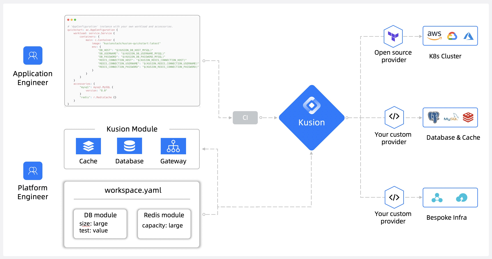
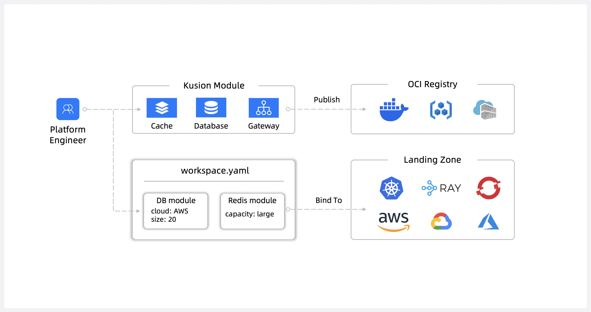
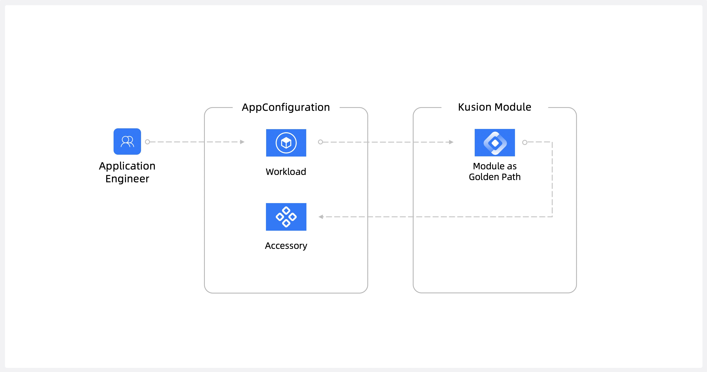

<div align="center">
<p></p><p></p>
<p>
    
</p>

<h1 style="font-size: 1.5em;">
    इंटेंट-ड्रिवन प्लेटफ़ॉर्म ऑर्केस्ट्रेटर
</h1>

<p align="center">
  <a href="https://www.kusionstack.io/docs/" target="_blank"><b>🌐 वेबसाइट</b></a> •
  <a href="https://www.kusionstack.io/docs/getting-started/getting-started-with-kusion-cli/deliver-quickstart" target="_blank"><b>⚡️ क्विक स्टार्ट</b></a> •
  <a href="https://www.kusionstack.io/docs/" target="_blank"><b>📚 दस्तावेज़</b></a> •
  <a href="https://kusion.kusionstack.io/" target="_blank"><b>📚 लैंडिंग पेज</b></a> •
  <a href="https://github.com/orgs/KusionStack/discussions" target="_blank"><b>💬 चर्चाएँ</b></a><br>
  [हिंदी]
  <a href="https://github.com/KusionStack/kusion/blob/main/README.md" target="_blank">[English]</a>
  <a href="https://github.com/orgs/KusionStack/discussions" target="_blank"><b>💬 讨论</b></a><br>
</p>

[](https://github.com/KusionStack/kusion/actions/workflows/release.yaml)
[](https://github.com/KusionStack/kusion/releases)
[](https://goreportcard.com/report/github.com/KusionStack/kusion)
[](https://pkg.go.dev/github.com/KusionStack/kusion)
[](https://github.com/KusionStack/kusion/blob/main/LICENSE)
[](https://artifacthub.io/packages/helm/kusionstack/kusion)
[](https://landscape.cncf.io/?item=provisioning--automation-configuration--kusionstack)
[](https://gitpod.io/#https://github.com/KusionStack/kusion)
[](https://twitter.com/KusionStack)
[](https://medium.com/@kusionstack)
[](https://cloud-native.slack.com/archives/C07U0395UG0)


<a href="https://www.producthunt.com/posts/kusion?embed=true&utm_source=badge-featured&utm_medium=badge&utm_souce=badge-kusion" target="_blank"></a>
<a href="https://www.producthunt.com/posts/kusion?embed=true&utm_source=badge-top-post-badge&utm_medium=badge&utm_souce=badge-kusion" target="_blank"></a>

</div>

## Kusion क्या है?

Kusion एक इंटेंट-ड्रिवन [प्लेटफ़ॉर्म ऑर्केस्ट्रेटर](https://internaldeveloperplatform.org/platform-orchestrators/) है, जो एक [इंटर्नल डेवलपर प्लेटफ़ॉर्म (IDP)](https://internaldeveloperplatform.org/what-is-an-internal-developer-platform/) के मूल में बैठता है। Kusion के साथ आप ऐप-केंद्रित विकास को सक्षम कर सकते हैं, आपके डेवलपर्स को केवल एक आवेदन विनिर्देश - [AppConfiguration](https://www.kusionstack.io/docs/concepts/appconfigurations) लिखने की आवश्यकता होती है। AppConfiguration वर्कलोड और सभी संसाधन निर्भरताओं को परिभाषित करता है बिना किसी पर्यावरण-विशिष्ट मानों को प्रदान किए, Kusion यह सुनिश्चित करता है कि इसे चलाने के लिए सभी आवश्यकताएँ उपलब्ध कराई जाएं।

Kusion ऐप डेवलपर्स और प्लेटफ़ॉर्म इंजीनियरों की मदद करता है, जो उन अनुप्रयोगों के लिए बुनियादी ढांचा बनाए रखने के लिए जिम्मेदार होते हैं। इन भूमिकाओं को आपके संगठन में विभिन्न रूपों में रखा जा सकता है, लेकिन Kusion का उद्देश्य इन दोनों कार्यों के लिए कार्यभार को कम करना है।

<div align="center">


</div>

## Kusion कैसे काम करता है?

एक प्लेटफ़ॉर्म ऑर्केस्ट्रेटर के रूप में, Kusion आपको Day 0 और Day 1 से जुड़े मुद्दों को हल करने में सक्षम बनाता है। प्लेटफ़ॉर्म इंजीनियर और एप्लिकेशन इंजीनियर दोनों Kusion से लाभ उठा सकते हैं।

Kusion के दो मुख्य वर्कफ़्लो हैं:

1. **Day 0 - मॉड्यूल और कार्यक्षेत्र सेटअप करें:** प्लेटफ़ॉर्म इंजीनियर आवेदन और उनके अंतर्निहित बुनियादी ढांचे को तैनात करने के लिए साझा मॉड्यूल बनाते हैं और लक्ष्य लैंडिंग ज़ोन के लिए कार्यक्षेत्र परिभाषाएँ बनाते हैं। ये मानकीकृत, साझा मॉड्यूल संगठन भर के हितधारकों की आवश्यकताओं को सुरक्षा, अनुपालन, और वित्त सहित कोडिफाई करते हैं।

	Kusion मॉड्यूल बुनियादी ढांचा टूलिंग की जटिलता को अमूर्त करता है, जिससे ऐप डेवलपर्स अपने अनुप्रयोगों को स्व-सेवा मॉडल का उपयोग करके तैनात कर सकते हैं।

	<div align="center">

	
	</div>
	
2. **Day 1 - एप्लिकेशन सेटअप करें:** एप्लिकेशन डेवलपर्स प्लेटफ़ॉर्म इंजीनियरों द्वारा बनाए गए कार्यक्षेत्र और मॉड्यूल का लाभ उठाकर अनुप्रयोगों और उनके सहायक बुनियादी ढांचे को तैनात करते हैं। प्लेटफ़ॉर्म टीम कार्यक्षेत्र और मॉड्यूल बनाए रखती है, जिससे एप्लिकेशन डेवलपर्स को मानकीकृत बुनियादी ढांचे पर एक दोहराए जाने योग्य प्रक्रिया का उपयोग करके एप्लिकेशन बनाने पर ध्यान केंद्रित करने की अनुमति मिलती है।

	<div align="center">

	
	</div>


## Kusion सर्वर और डेवलपर पोर्टल का परिचय

Kusion v0.14.0 के साथ, हम आधिकारिक रूप से Kusion सर्वर और डेवलपर पोर्टल का परिचय दे रहे हैं।

Kusion सर्वर एक लंबी-चलने वाली सेवा के रूप में चलता है, जो Kusion CLI के समान कार्यक्षमता प्रदान करता है, साथ ही एप्लिकेशन मेटाडेटा और विज़ुअलाइज़्ड एप्लिकेशन संसाधन ग्राफ़ को प्रबंधित करने की अतिरिक्त क्षमताओं के साथ। 

Kusion सर्वर परियोजनाओं, स्टैक्स, कार्यक्षेत्रों, रन आदि के उदाहरणों का केंद्रीय रूप से प्रबंधन करता है, डेवलपर पोर्टल और अन्य प्रणालियों के साथ एक RESTful API सेट के माध्यम से।

https://github.com/user-attachments/assets/d4edac23-cc01-417f-b08d-de137253c9eb

## Kusion सर्वर और डेवलपर पोर्टल के साथ क्विक स्टार्ट

Kusion सर्वर के साथ शुरू करने के लिए:

1. पहले, [इंस्टॉलेशन गाइड](https://www.kusionstack.io/docs/getting-started/getting-started-with-kusion-server/install-kusion) का पालन करके Kusion सर्वर स्थापित करें।

>**ध्यान दें** कि आपको गाइड के अनुसार अपना kubeconfig ठीक से कॉन्फ़िगर करना होगा, क्योंकि Kusion सर्वर को कार्य करने के लिए एक Kubernetes क्लस्टर की आवश्यकता होती है।

2. फिर, [QuickStart गाइड](https://www.kusionstack.io/docs/getting-started/getting-started-with-kusion-server/deliver-quickstart) का पालन करें ताकि आप Kusion सर्वर का उपयोग करके अपना पहला एप्लिकेशन तैनात करना सीख सकें।

## Kusion CLI के साथ क्विक स्टार्ट

यह गाइड कवर करेगा:

1. Kusion CLI को स्थापित करें।
2. Kusion के साथ एक एप्लिकेशन Kubernetes में तैनात करें।

### इंस्टॉल करें

#### Homebrew (macOS & Linux)

```shell
# Kusionstack/tap सूत्र रिपॉजिटरी जोड़ें
brew tap KusionStack/tap

# Kusion स्थापित करें
brew install KusionStack/tap/kusion
```

#### PowerShell

```
# Kusion का नवीनतम संस्करण स्थापित करें
powershell -Command "iwr -useb https://www.kusionstack.io/scripts/install.ps1 | iex"
```

> CLI इंस्टॉलेशन के बारे में अधिक जानकारी के लिए कृपया [CLI इंस्टॉलेशन गाइड](https://www.kusionstack.io/docs/getting-started/getting-started-with-kusion-cli/install-kusion) देखें।

### तैनात करें

एक एप्लिकेशन को तैनात करने के लिए, आप `kusion apply` कमांड चला सकते हैं।

> Kusion को तेजी से चालू करने के लिए कृपया [Quick Start गाइड](https://www.kusionstack.io/docs/getting-started/getting-started-with-kusion-cli/deliver-quickstart) का पालन करें।


## केस स्टडीज

यहां कुछ केस स्टडीज़ हैं कि कैसे Kusion उत्पादन में उपयोगी हो सकता है:

- जनवरी 2025: [Ant Group में विन्यास प्रबंधन: जनरेटेड मैनिफेस्ट और अपरिवर्तनीय इच्छित स्थिति](https://blog.kusionstack.io/configuration-management-at-ant-group-generated-manifest-immutable-desired-state-3c50e363a3fb)
- जनवरी 2024: [AppConfiguration का उपयोग करके एप्लिकेशन डिलीवरी का मॉडलिंग](https://blog.kusionstack.io/modeling-application-delivery-using-appconfiguration-d291830de8f1)

## संपर्क

यदि आपके पास कोई प्रश्न हैं, तो कृपया निम्नलिखित तरीकों से हमसे संपर्क करें:

- [Slack](https://kusionstack.slack.com) | [Join](https://join.slack.com/t/kusionstack/shared_invite/zt-2drafxksz-VzCZZwlraHP4xpPeh_g8lg)
- [DingTalk समूह](https://page.dingtalk.com/wow/dingtalk/act/en-home): `42753001`  (चीनियाँ)
- WeChat समूह (चीनियाँ): उपयोगकर्ता समूह में लाने के लिए WeChat सहायक को जोड़ें।

  

## योगदान

यदि आप योगदान करना चाहते हैं, तो कृपया [Contributing Guide](./CONTRIBUTING.md) का पालन करें **प्रस्तुत करने से पहले 
एक पुल अनुरोध**।

## लाइसेंस

Kusion Apache 2.0 लाइसेंस के तहत है। विवरण के लिए कृपया [LICENSE](LICENSE) फ़ाइल देखें।

## OpenSSF बेस्ट प्रैक्टिस बैज
[](https://www.bestpractices.dev/projects/9586)

