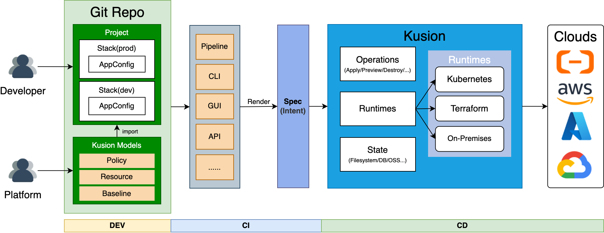

<div align="center">
<p></p><p></p>
<p>
    
</p>
<h1>更高效、更安全地构建你的内部研发者平台</h1>

[简体中文](https://github.com/KusionStack/kusion/blob/main/README-zh.md) | [English](https://github.com/KusionStack/kusion/blob/main/README.md)

[Konfig](https://github.com/KusionStack/konfig) | [KCLVM](https://github.com/KusionStack/KCLVM) | [Kusion](https://github.com/KusionStack/kusion) | [kusionstack.io](https://kusionstack.io/) | [CNCF Landscape](https://landscape.cncf.io/?selected=kusion-stack)

[](https://github.com/KusionStack/kusion/actions/workflows/release.yaml)
[](https://github.com/KusionStack/kusion/releases)
[](https://goreportcard.com/report/github.com/KusionStack/kusion)
[](https://coveralls.io/github/KusionStack/kusion)
[](https://pkg.go.dev/github.com/KusionStack/kusion)
[](https://github.com/KusionStack/kusion/blob/main/LICENSE)
</div>

# Kusion

Kusion 是 [KusionStack](https://github.com/KusionStack) 的云原生平台工程引擎，旨在帮助您构建高效且安全的内部开发者平台（IDP）。它允许应用程序开发者在一个地方轻松且一致地完成 DevOps 生命周期中的所有运维任务，跨越包括 Kubernetes、云平台和自建基础设置在内的不同基础设施。

## 核心能力

- **平台代码化**：在同一个地方、以统一的方式，管理应用所有的运维操作。
- **动态配置管理**：开发人员可用一份与环境无关的配置，部署到任何环境，环境差异性由 Kusion 处理。
- **研发自服务**：开发人员可以通过选择平台工程师在 [Kusion Modules](https://www.kusionstack.io/docs/next/kusion/concepts/kusion-module) 中提供的功能来自助满足需求。
- **内置安全性和合规性**：平台工程师可以通过灵活的平台配置，实现满足安全性、合规性和最佳实践的标准化应用程序交付。
- **开放模块生态系统**：不断增长的开放模块生态系统涵盖了 DevOps 生命周期的所有阶段，并与各种云原生基础设施有广泛的连接。
- **轻量级并且 Kubernetes 友好**：Kusion 作为一个纯客户端解决方案，拥有丰富的 API，提供了出色的可移植性和集成便利性。同时用户友好的可观察性和故障排除能力使得 Kubernetes 操作更加简单。

<div align="center">


</div>

## 快速开始

### 部署第一个应用

参考 [Quick Start](https://www.kusionstack.io/docs/kusion/getting-started/deliver-wordpress) 通过 Kusion
部署您的第一个应用


## 安装

### Homebrew (macOS & Linux)

```shell
brew install KusionStack/tap/kusion
```

### Go Install

```shell
go install kusionstack.io/kusion@latest
```

### Docker

```shell
docker pull kusionstack/kusion:latest
```

> 有关安装的更多信息，请查看 KusionStack 官网的[安装指南](https://www.kusionstack.io/docs/kusion/getting-started/install-kusion)。

# 联系我们 
- Twitter: [KusionStack](https://twitter.com/KusionStack)
- Slack: [Kusionstack](https://join.slack.com/t/kusionstack/shared_invite/zt-2drafxksz-VzCZZwlraHP4xpPeh_g8lg)
- 钉钉: 42753001
- 微信群 

  

# 🎖︎ 贡献指南

Kusion 仍处在快速发展阶段，有很多能力需要补全，我们欢迎所有人参与进来与我们一起共建。
访问[贡献指南](docs/contributing.md)了解如何参与到贡献 Kusion 项目中。
如有任何疑问欢迎[提交 Issue](https://github.com/KusionStack/kusion/issues)。
