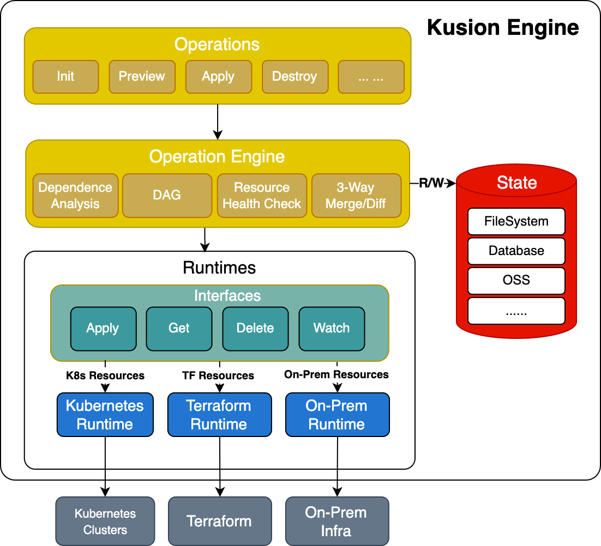

<div align="center">
<p></p><p></p>
<p>
    
</p>
<h1>A Unified Programmable Configuration Tech Stack</h1>

[简体中文](https://github.com/KusionStack/kusion/blob/main/README-zh.md) | [English](https://github.com/KusionStack/kusion/blob/main/README.md)

[Konfig](https://github.com/KusionStack/konfig) | [KCLVM](https://github.com/KusionStack/KCLVM) | [Kusion](https://github.com/KusionStack/kusion) | [Website](https://kusionstack.io/)

[](https://github.com/KusionStack/kusion/releases)
[](https://goreportcard.com/report/github.com/KusionStack/kusion)
[](https://github.com/KusionStack/kusion/blob/main/LICENSE)
[](https://pkg.go.dev/github.com/KusionStack/kusion)
[](https://coveralls.io/github/KusionStack/kusion)
</div>

# Kusion
Kusion 是 [KusionStack](https://github.com/KusionStack) 的引擎，用于解析用户在 [Konfig](https://github.com/KusionStack/konfig) 中描述的运维意图，并根据这些运维意图对真实的基础设执行相应的操作
## 核心能力

- **应用全生命周期管理**: 结合 [Kusion](https://github.com/KusionStack/kusion) 与 [Konfig](https://github.com/KusionStack/konfig) 实现从应用第一行配置代码到生产可用的全生命周期管理
- **多层级管理**: 原生支持多租户、多环境运维能力
- **混合运行时**: 以统一的方式运维 Kubernetes 和 Terraform 等多种运行时的资源
- **厂商无关**: 一次编写，动态渲染，多云运行

<div align="center">


</div>

## 快速开始

参考 [快速开始](https://kusionstack.io/docs/user_docs/getting-started/usecase) 通过一条 Kusion 命令拉起一个应用


## 安装

### 二进制安装

从二进制安装，只需从 `kusion` 的 [发布页面](https://github.com/KusionStack/kusion/releases) 下载对应平台的二进制文件，然后将二进制文件放在命令行能访问到的目录中即可。

### Kusinoup

你可以通过 `kusionup` 安装多个 `kusion` 版本，默认会安装最新版。

#### 安装 Kusionup
```
# Homebrew
brew install KusionStack/tap/kusionup
```
```
# cURL
curl -sSf https://raw.githubusercontent.com/KusionStack/kusionup/main/scripts/install.sh | bash
```
#### 安装 Kusion
```
# visit https://github.com/KusionStack/kusionup for more details
kusionup install
```
### Docker

Docker users can use the following commands to pull the latest image of the `kusion`:

```
docker pull kusionstack/kusion:latest
```

# 🎖︎ 贡献指南

Kusion 仍处在初级阶段，有很多能力需要补全，所以我们欢迎所有人参与进来与我们一起共建。
访问[贡献指南](docs/contributing.md)了解如何参与到贡献 Kusion 项目中。
如有任何疑问欢迎[提交 Issue](https://github.com/KusionStack/kusion/issues)。
