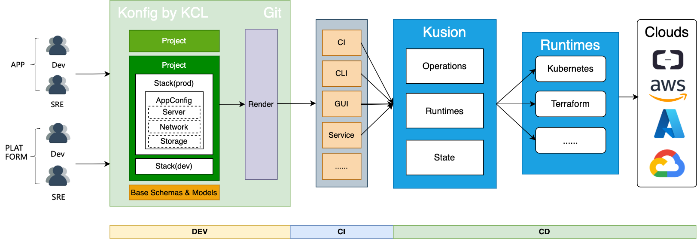

<div align="center">
<p></p><p></p>
<p>
    
</p>
<h1>Codify, Self-Service, Automate modern App delivery across Kubernetes and Clouds</h1>

[简体中文](https://github.com/KusionStack/kusion/blob/main/README-zh.md) | [English](https://github.com/KusionStack/kusion/blob/main/README.md) 

[Konfig](https://github.com/KusionStack/konfig) | [KCLVM](https://github.com/KusionStack/KCLVM) | [Kusion](https://github.com/KusionStack/kusion) | [kusionstack.io](https://kusionstack.io/) | [CNCF Landscape](https://landscape.cncf.io/?selected=kusion-stack)

[](https://github.com/KusionStack/kusion/actions/workflows/release.yaml)
[](https://github.com/KusionStack/kusion/releases)
[](https://goreportcard.com/report/github.com/KusionStack/kusion)
[](https://coveralls.io/github/KusionStack/kusion)
[](https://pkg.go.dev/github.com/KusionStack/kusion)
[](https://github.com/KusionStack/kusion/blob/main/LICENSE)
</div>

# Kusion

Kusion is the platform engineering engine of [KusionStack](https://github.com/KusionStack). It delivers intentions
described in [Konfig](https://github.com/KusionStack/konfig) to Kubernetes, Clouds and Customize infrastructure
resources

## Key Features

- **App Whole Lifecycle Management**: Manage App from the first code to production-ready
  with [Kusion](https://github.com/KusionStack/kusion) and [Konfig](https://github.com/KusionStack/konfig)
- **Self-Service**: Enable App Dev self-service capabilities and help them cooperate with SRE and Platform Dev
  efficiently
- **Hybrid Runtime**: Orchestrate hybrid runtime resources like Kubernetes, Terraform and your customized infrastructure
  resource in a unified way
- **Vendor Agnostic**: Write once, render dynamically, deliver to any cloud

<div align="center">


</div>

## Quick Start
Visit [Quick Start](https://kusionstack.io/docs/user_docs/getting-started/usecase) to deliver an App with one Kusion command


## Installation

### Homebrew (macOS & Linux)

```shell
brew install KusionStack/tap/kusion
```

### Go Install

```shell
go install kusionstack.io/kusion@latest
```

### Docker

```
docker pull kusionstack/kusion:latest
```

> For more information about installation, please check the [Installation Guide](https://kusionstack.io/docs/user_docs/getting-started/install) on KusionStack official website

## Deploy your first App
Deploy your first App with one Kusion command. Please visit this [use case](https://kusionstack.io/docs/user_docs/getting-started/usecase) for more details

# Contact Us
- Twitter: [KusionStack](https://twitter.com/KusionStack)
- Slack: [Kusionstack](https://join.slack.com/t/kusionstack/shared_invite/zt-19lqcc3a9-_kTNwagaT5qwBE~my5Lnxg)
- DingTalk (Chinese): 42753001
- Wechat Group (Chinese)

  


# 🎖︎ Contribution Guide

Kusion is still in the initial stage, and there are many capabilities that need to be made up, so we welcome everyone to participate in construction with us. Visit the [Contribution Guide](docs/contributing.md) to understand how to participate in the contribution KusionStack project. If you have any questions, please [Submit the Issue](https://github.com/KusionStack/kusion/issues).
