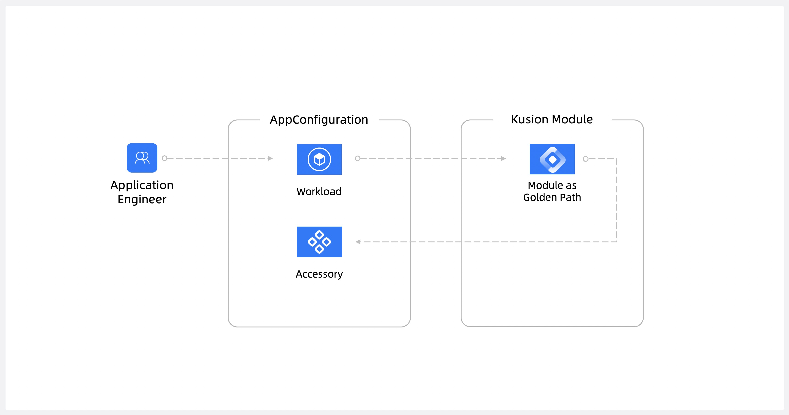

<div align="center">
<p></p><p></p>
<p>
    
</p>

<h1 style="font-size: 1.5em;">
    Intent-Driven Platform Orchestrator
</h1>

<p align="center">
  <a href="https://www.kusionstack.io/docs/" target="_blank"><b>🌐 Website</b></a> •
  <a href="https://www.kusionstack.io/docs/getting-started/deliver-quickstart" target="_blank"><b>⚡️ Quick Start</b></a> •
  <a href="https://www.kusionstack.io/docs/" target="_blank"><b>📚 Docs</b></a> •
  <a href="https://github.com/orgs/KusionStack/discussions" target="_blank"><b>💬 Discussions</b></a><br>
  [English] 
  <a href="https://github.com/KusionStack/kusion/blob/main/README-zh.md" target="_blank">[中文]</a>
</p>

[](https://github.com/KusionStack/kusion/actions/workflows/release.yaml)
[](https://github.com/KusionStack/kusion/releases)
[](https://goreportcard.com/report/github.com/KusionStack/kusion)
[](https://pkg.go.dev/github.com/KusionStack/kusion)
[](https://github.com/KusionStack/kusion/blob/main/LICENSE)

</div>

## What is Kusion?

Kusion is an intent-driven [Platform Orchestrator](https://internaldeveloperplatform.org/platform-orchestrators/), which sits at the core of an [Internal Developer Platform (IDP)](https://internaldeveloperplatform.org/what-is-an-internal-developer-platform/). With Kusion you can enable app-centric development, your developers only need to write a single application specification - [AppConfiguration](https://www.kusionstack.io/docs/concepts/app-configuration). [AppConfiguration](https://www.kusionstack.io/docs/concepts/app-configuration) defines the workload and all resource dependencies without needing to supply environment-specific values, Kusion ensures it provides everything needed for the application to run.

Kusion helps app developers who are responsible for creating applications and the platform engineers responsible for maintaining the infrastructure the applications run on. These roles may overlap or align differently in your organization, but Kusion is intended to ease the workload for any practitioner responsible for either set of tasks.

<div align="center">


</div>

## How does Kusion work?

As a Platform Orchestrator, Kusion enables you to address challenges often associated with Day 0 and Day 1. Both platform engineers and application engineers can benefit from Kusion.

There are two key workflows for Kusion:

1. **Day 0 - Set up the modules and workspaces:** Platform engineers create shared modules for deploying applications and their underlying infrastructure, and workspace definitions for target landing zone. These standardized, shared modules codify the requirements from stakeholders across the organization including security, compliance, and finance.

	Kusion modules abstract the complexity of underlying infrastructure tooling, enabling app developers to deploy their applications using a self-service model.
	
	<div align="center">

	
	</div>
	
2. **Day 1 - Set up the application:** Application developers leverage the workspaces and modules created by the platform engineers to deploy applications and their supporting infrastructure. The platform team maintains the workspaces and modules, which allows application developers to focus on building applications using a repeatable process on standardized infrastructure.

	<div align="center">

	
	</div>

## Quick Start

This guide will cover:

1. Install Kusion CLI using package manager.
2. Deploy an application to Kubernetes with Kusion.

### Install

#### Homebrew (macOS & Linux)

```shell
# tap formula repository Kusionstack/tap
brew tap KusionStack/tap

# install Kusion 
brew install KusionStack/tap/kusion
```

#### Scoop

```
# add scoop bucket KusionStack
scoop bucket add KusionStack https://github.com/KusionStack/scoop-bucket.git

# install kusion
scoop install KusionStack/kusion
```

> For more information about installation, please refer to the [Installation Guide](https://www.kusionstack.io/docs/getting-started/install-kusion) for more options.

### Deploy

To deploy an application, you can run the `kusion apply` command.


> To rapidly get Kusion up and running, please refer to the [Quick Start Guide](https://www.kusionstack.io/docs/getting-started/deliver-quickstart).


## Contact

If you have any questions, feel free to reach out to us in the following ways:

- [Slack](https://kusionstack.slack.com) | [Join](https://join.slack.com/t/kusionstack/shared_invite/zt-2drafxksz-VzCZZwlraHP4xpPeh_g8lg)
- [DingTalk Group](https://page.dingtalk.com/wow/dingtalk/act/en-home): `42753001`  (Chinese)
- Wechat Group (Chinese): Broker wechat to add you into the user group.

  

## Contributing

If you're interested in contributing, please refer to the [Contributing Guide](CONTRIBUTING.md) **before submitting a pull request**.

## License

Kusion is under the Apache 2.0 license. See the [LICENSE](LICENSE) file for details.
