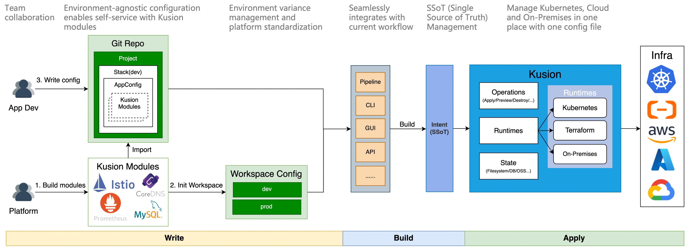

<div align="center">
<p></p><p></p>
<p>
    
</p>
<h1>Build your Internal Developer Platform more effectively and safely</h1>

[简体中文](https://github.com/KusionStack/kusion/blob/main/README-zh.md)
| [English](https://github.com/KusionStack/kusion/blob/main/README.md)

[kusionstack.io](https://kusionstack.io/) | [Konfig](https://github.com/KusionStack/konfig) | [Catalog](https://github.com/KusionStack/catalog) | [CNCF Landscape](https://landscape.cncf.io/?selected=kusion-stack)

[](https://github.com/KusionStack/kusion/actions/workflows/release.yaml)
[](https://github.com/KusionStack/kusion/releases)
[](https://goreportcard.com/report/github.com/KusionStack/kusion)
<!-- [](https://coveralls.io/github/KusionStack/kusion) -->
[](https://pkg.go.dev/github.com/KusionStack/kusion)
[](https://github.com/KusionStack/kusion/blob/main/LICENSE)
</div>

# Kusion

Kusion is a cloud-native platform engineering engine from [KusionStack](https://github.com/KusionStack), designed to help you build an efficient and secure Internal Developer Platform (IDP). It enables application developers to complete all operational tasks in the DevOps lifecycle in one place, in a unified manner, without worrying about the complexity of the underlying infrastructure (Kubernetes, cloud platforms, and self-hosted services). It also offers a flexible Module extension mechanism for platform engineers, facilitating the abstraction, reuse, and standardization of foundational capabilities, thereby enabling self-service for application development.

## Key Features

- **Platform as Code**: Managing all application operations in one place, in a unified, easy way.
- **Dynamic Configuration Management**: Developers deploy to any environment using one environment-agnostic configuration, while Kusion handles the underlying complexity.
- **Enable Self-Service**: Developers fulfill their own needs by choosing the capabilities provided by the platform engineers in [Kusion Modules](https://www.kusionstack.io/docs/concepts/kusion-module/overview).
- **Built-in Security and Compliance**: Platform engineers standardize application deliveries with security, compliance, and best practices by flexible platform configurations.
- **Open Module Ecosystem**: A growing open module ecosystem covers all stages of the DevOps lifecycle, with extensive connections to various cloud-native infrastructures.
- **Lightweight and Kubernetes-friendly**: As a pure client-side solution with rich APIs, Kusion offers excellent portability and ease of integration. Meanwhile, user-friendly observability and troubleshooting capabilities make Kubernetes operations easier.

<div align="center">


</div>

## Quick Start

### Deploy your first App

Visit [Quick Start](https://www.kusionstack.io/docs/getting-started/deliver-quickstart) to deliver an
App with one Kusion command


## Installation

### Homebrew (macOS & Linux)

```shell
brew install KusionStack/tap/kusion
```

### Docker

```
docker pull kusionstack/kusion:latest
```

> For more information about installation, please check the [Installation Guide](https://www.kusionstack.io/docs/getting-started/install-kusion) on KusionStack official website


# Contact Us

- Twitter: [KusionStack](https://twitter.com/KusionStack)
- Slack: [Kusionstack](https://join.slack.com/t/kusionstack/shared_invite/zt-2drafxksz-VzCZZwlraHP4xpPeh_g8lg)
- DingTalk (Chinese): 42753001
- Wechat Group (Chinese)

  


# 🎖︎ Contribution Guide

Kusion is still in the rapid development stage with many capabilities to be enhanced. We welcome everyone to join us and contribute to the collaborative growth.

Visit the [Contribution Guide](docs/contributing.md) to understand how to participate in the contribution KusionStack project. If you have any questions, please [Submit the Issue](https://github.com/KusionStack/kusion/issues).
