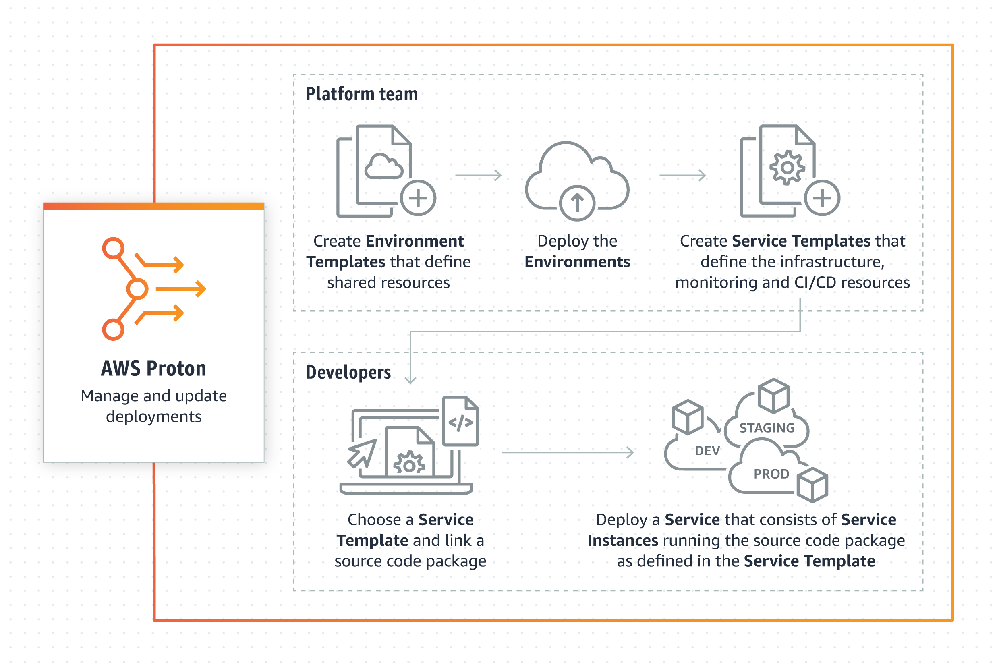
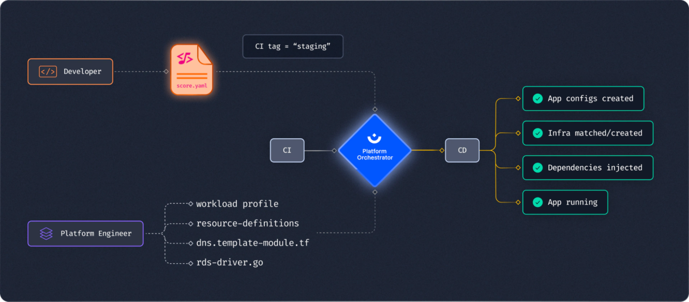
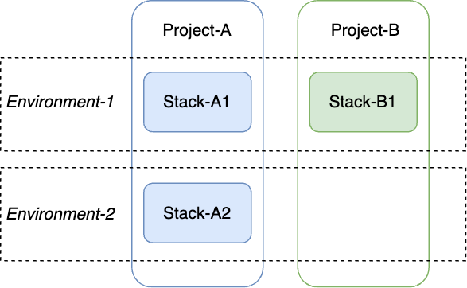
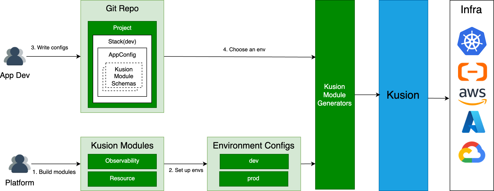

# Define the Collaboration Paradigm Between App Developers and Platform Engineers With Kusion

# Context

As part of the adoption of cloud-native technologies, an increasing amount of concepts, tools, and platforms are being added to a bloated application delivery and operational workflow. Application developers are practically forced to be familiar with all these new pieces to be able to deliver and operate an application, resulting in a very high cognitive burden.

With the increasing complexity of applications and their operational demands, standardizing them also becomes difficult. We are observing an increasing amount of customized effort from the platform engineers to support the heterogeneous application workloads effectively. This also leads the platform team to become the bottleneck of the organization's efficiency.

Certain application delivery and operational tasks require a joint effort between application developers and platform engineers, but the collaboration paradigm between the two teams is unclear. For example, if an application requires public internet access, how is that responsibility for configuring and maintaining the LoadBalancer and DNS components divided?

This design documentation tries to clarify our principles and thought process on defining the collaboration paradigm between application developers and platform engineers to improve overall organizational efficiency. Furthermore, we will give a detailed design at the end with some examples to demonstrate how application developers and platform engineers can cooperate with Kusion.

# Goals and Non-Goals

## Goals

- This paradigm aims to facilitate collaboration between application developers and platform engineers.
- This paradigm must be application developer-friendly and reduce the application developer's cognitive load.
- This paradigm can standardize applications' behavior and have the flexibility to meet snowflake applications' demands easily.

## Non-goals

- We will provide some out-of-the-box models for most situations with a mechanism to extend them but that does not mean these models are suitable for all situations in all companies.

# Research

There are many platform engineering projects available in the market. We have chosen two popular projects, one of which is from the AWS cloud and the other is from a startup company. This section will introduce how they address the collaboration boundary and analyze the pros and cons. Introductions on the basic concepts and the complete workflow of these projects are NOT included, you can check out the links in the references section for more details.

## AWS Proton

<p align="center">

</>

AWS Proton is a deployment workflow tool for modern applications that helps platform and DevOps engineers achieve organizational agility.

The complete workflow is illustrated in the above diagram. platform engineers provide two templates: an environment template and a service template, and register them to the system. The environment template defines shared infrastructure, such as a VPC or a cluster that is used by multiple applications or resources. Service template defines the type of infrastructure that's needed to deploy and bootstrap an application or microservice in an environment.

### Platform developer's view

platform engineers identify input parameters that should be exposed to application developers and create a [schema](https://github.com/aws-samples/aws-proton-cloudformation-sample-templates/blob/main/loadbalanced-fargate-svc/loadbalanced-fargate-svc/v1/schema/schema.yaml) file to define the input parameters, then create IaC files(CloudFormation files or Terraform files) that reference input parameters. Finally, they register a template version with AWS Proton and upload these template bundles.

### Application developer's view

The application developer chooses a service template and fills in the necessary parameters in a `spec.yaml` file to instruct Proton to provision all resources specified in the spec.

Here is a `spec.yaml` [example](https://github.com/aws-samples/aws-proton-cloudformation-sample-templates/blob/main/loadbalanced-fargate-svc/specs/svc-spec.yaml). In this file, the app developer configures a load-balanced service instance in the instances block. The underlying LoadBalancedService schema specification (defined by the platform team) can be found [here](https://github.com/aws-samples/aws-proton-cloudformation-sample-templates/blob/main/loadbalanced-fargate-svc/loadbalanced-fargate-svc/v1/schema/schema.yaml) which defines all the attributes that application developers can configure. All these configurations will be translated into resources in this [cloudformation.yaml](https://github.com/aws-samples/aws-proton-cloudformation-sample-templates/blob/main/loadbalanced-fargate-svc/loadbalanced-fargate-svc/v1/instance_infrastructure/cloudformation.yaml) file.

```yaml
proton: ServiceSpec

pipeline:
  unit_test_command: "ls"

instances:
  - name: "frontend-dev"
    environment: "Beta"
    spec:
      desired_count: 2
      port: 80
      task_size: "medium"
```

### Pros

- Separate app developers' and platform engineers' concerns and enable developers to self-service
- As a commercially available cloud product, it has grown to a higher level of maturity compared to other startups or open-source products. It provides a complete workflow with advanced features such as RBAC, template lifecycle management and registry, CI/CD Pipeline integration, etc

### Cons

- According to the official definition and its templates repo, Proton focuses on provisioning and standardizing infrastructures. In other words, it is not an app-centric product, app developers must be aware of all IaaS resources even though they are encapsulated by templates, resulting in a higher cognitive load.
- As an AWS product, it mainly focuses on how to manage AWS cloud resources and can not integrate with other cloud vendors.

## Humanitec

<p align="center">

</>

Humanitec is a well-known project in the field of platform engineering. It is also the founder of the platform engineering community. This diagram illustrates how app developers collaborate with platform engineers using the Humanitec products. Developers use the [Score](https://score.dev/) specification to describe their Workload, including its resource and service dependencies. The platform engineers take care of the rest to make sure the application runs as intended.

### Platform developer's view

Humanitec provides many [built-in drivers](https://developer.humanitec.com/integration-and-extensions/drivers/overview/#built-in-drivers), if existing drivers can not meet your requirements, you can build your own custom drivers. In general, Humanitec Drivers are similar to Terraform providers which is an API service fulfilling the Humanitec Driver Interface. According to the official website, they are working on a new API spec, so you can only contact their staff to build your driver now, but you can leverage Terraform providers with its [generic Terraform drivers](https://developer.humanitec.com/integration-and-extensions/drivers/generic-drivers/terraform/).
Platform engineers build the driver and they decide the driver's inputs. They also are responsible for configuring matching criteria to provide a resource in a given resource context.

### Application developer's view

The  Score specification consists of four parts: workload definition, containers, resources, and service. All attributes application developers can configure are defined in this [specification](https://docs.score.dev/docs/reference/score-spec-reference/). Taking Postgres as an example, app developers only need to declare that they need a Postgres database in the resources block and all the other attributes like engine version, storage size, etc. are configured by the platform engineers.

```yaml
apiVersion: score.dev/v1b1
metadata:
  name: backend

containers:
... ...

resources:
  db:
    type: postgres
```

### Pros

- The score file significantly reduces app developers' cognitive load and separates app developers' and platform engineers' concerns.
- Support the complete software lifecycle, including monitoring, logging, secret management, and more.

### Cons

- Most of the work was handed over to platform engineers. Different applications may have different requirements for the same resource attribute, and platform engineers' workload has increased several times.
It is reasonable to allow app developers to configure certain attributes, such as the database engine version since it can impact their business logic code.

## Summary

We won't list all the projects we have researched here. Each project has its advantages and we have learned a lot from them, but none of them can meet the goals defined above. The following section will introduce our proposal.

# Our Design

Based on our extensive practical experiences and in-depth conversations with other companies, teams involved in the SDLC(Software Development Life Cycle) are typically categorized into two roles: platform engineers and application developers.

- application developers mainly focus on business logic and choose infrastructure services they depend on to deliver their business value.
- Platform engineers are responsible for infrastructure standardization which helps to reduce the cognitive load of application developers and meet their requirements. This, in turn, boosts productivity and provides standardization value for the organization.

We aim to minimize application developers' cognitive load and enable self-service so we do not let application developers care about low-level infrastructure details. They only need to declare what feature they want in a developer-friendly way, such as declaring one application needs a MySQL database and public Internet access with Kusion modules provided by platform engineers. Then Kusion will provision a MySQL database and a LoadBalancer that complies with platform standardization.

We introduce a set of Kusion modules to standardize deployment and the root module is AppConfiguration. AppConfiguration is a declarative application configuration model maintained by application developers to configure all operation intentions during SDLC and more details can be found on our [website](https://kusionstack.io/docs/user_docs/concepts/appconfiguration). Each Kusion module in the AppConfiguration represents a building block built by platform engineers to standardize the application's behavior and hide infrastructure complexity, such as database, networking, and monitoring.

## Terms

Before we dive into details, it is necessary to clarify certain terms.

- Environment: Environment is a logical concept representing a target that an application will be deployed to. We just recommend they be grouped by SDLC phases or cloud vendors. For example, it could be named as `dev`, `staging`, and `prod` or cloud vendors such as `AWS`, `Azure`, and `Aliyun` or a even combination of the two.
- [Project](https://kusionstack.io/docs/user_docs/concepts/glossary#project): A project is a logical concept to bundle application configurations.
- [Stack](https://kusionstack.io/docs/user_docs/concepts/glossary#stack): A stack is a logical concept that provides a mechanism to isolate multiple deploys of the same application. It is the smallest operational unit that can be configured and deployed independently and must be linked with one environment.

<p align="center">

</>

## Platform developer's workflow

### Design Kusion modules

A Kusion module is a building block designed by platform engineers to standardize application deployments and it consists of two parts:

- App developer-oriented schema: Fields in this schema are recommended to be understandable to application developers and environment-agnostic. For example, a database Kusion module schema only contains fields like database engine type and database version.
- Kusion module generator: As a building block, Kusion module hides the complexity of infrastructures. A database Kusion module not only represents a cloud RDS, but it also contains logic to configure other resources such as security groups and IAM policies. Additionally, it seamlessly injects the database host address, username, and password into the workload's environment variables. The generator logic can be very complex in some situations so we recommend implementing it in a GPL like `Go`.

<p align="center">

</>

A database Kusion module schema is as follows.

```python
schema Database: 
    """ Database provides a database instance for the workload. 

    Attributes
    ----------
    engine: str, default is Undefined, required. 
        The field engine specifies the database engine to be used. 
    version: str, default is Undefined, required. 
        The field version specifies the database engine version to be used. 

    Examples
    --------
    Instantiate a database with MySQL 5.7. 

    import models.schema.v1.accessories.database as db

    database: db.Database {
        engine: "mysql"
        version: "5.7"
    }
    """

    # The database engine to be used. 
    engine:             str

    # The database engine version to be used. 
    version:            str
```

Application developers will choose Kusion modules they need and instantiate them in the AppConfiguration to describe their operation intentions. We have built some built-in Kusion modules in the repository [Catalog](https://github.com/KusionStack/catalog) and we warmly welcome you to join us in building this ecosystem together.
  
### Instantiate and set up environments

Each environment includes a corresponding config file maintained by platform engineers. The environment config file contains values that are used to standardize applications but vary from different environments. For example, the subnets in the `prod` and `dev` environment of one application are usually different and platform engineers can change these platform standardizations easily by instantiating two different environment configs.

Platform engineers should instantiate all environments and fulfill all fields with platform default values. An example is as follows.

```yaml
# default configs applied to all applications
default:
# database and ports are Kusion modules designed by platform engineers. The keys here are Kusion module generator inputs.
  database:
    instanceClass: mysql.n2.serverless.1c
    category: serverless_basic
    subnet: "10.0.0.0/18"
  ports:
    loadbalancerSpec: slb.s1.small
# configs only applied to application app1. Configs below will override default configs
app1:
  database:
    instanceClass: mysql.n2.serverless.2c
```

The `database` block represents a Kusion module and the fields in it are inputs of the Kusion module generator. Configurations in the `default` block will be applied to all applications in this environment and configurations in the `app1` block will only be applied to application `app1` and they will override default configs with the same field name.

## Application developer's workflow

### Instantiate AppConfiguration

`main.k` is the **only** configuration maintained by application developers and schemas in this file are defined from the application developer's perspective to reduce their cognitive load. An example is as follows.

```pthyon
wordpress: ac.AppConfiguration {
    workload: wl.Service {
        containers: {
            wordpress: c.Container {
                image = "wordpress:4.8-apache"
                env: {
                    "WORDPRESS_DB_HOST": "$database.hostname"
                    "WORDPRESS_DB_PASSWORD": "$database.password"
                }
                resources: {
                    "cpu": "500m"
                    "memory": "512Mi"
                }
            }
        }
        replicas: 1
        ports: [
            n.Port {
                port: 80
            }
        ]
    }
    database: db.Database {
        engine: "MySQL"
        version: "5.7"
    }
}
```

`workload` and `database` are both Kusion modules provided by platform engineers and Kusion will convert them into actual infrastructure API calls eventually.

### Choose an Environment

The application developer should choose an environment provided by platform engineers by setting the environment config file path into the OS environment variables `KUSION_ENV`. This step links the application developer's config with an environment config and Kusion will combine them and convert them into the inputs of Kusion module generators.

<p align="center">

</>

Summary
This paradigm has three advantages:

1. Separate concerns of application developers and platform engineers by using different Kusion modules to facilitate collaboration between them.
2. Minimize the application developer's cognitive load and enable self-service by allowing them to simply select curated application-centric schemas and configure attributes related to the application business logic.
3. Organizations can adopt this paradigm in their team easily according to their actual situations, given all components are extensible. We have open-sourced a set of out-of-box Kusion modules for users to start, and all resource schemas are extensible and open to modification.

# References

- <https://docs.aws.amazon.com/proton/>
- <https://docs.score.dev/docs/overview/>
- <https://humanitec.com/>
- <https://kusionstack.io/>
