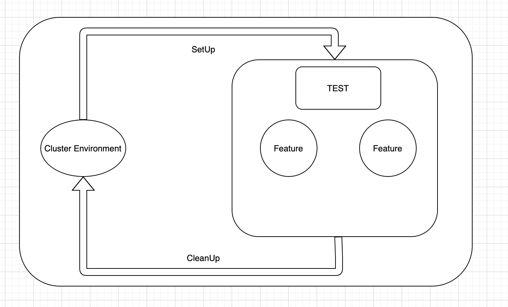

# E2E Test
This document describes kusion end-to-end testing.

## Goals
* Introduce kusion end-to-end testing solution to help with adoption
* Easily express end-to-end test
* Ensure kusion code quality
* Automate end-to-end testing with CI


## Design
  Kusion end-to-end testing is built on [ginkgo](https://onsi.github.io/ginkgo/) and [gomega](https://onsi.github.io/gomega/), The design contain several components that can be used to compose end-to-end tests as depicted below:
  * Cluster Environment
  * Features Test

  

### Cluster Environment
  The Cluster Environment represents the kubernetes cluster in kusion end-to-end tests.

  K3s is a lightweight kubernetes cluster, We use k3s as a development cluster in end-to-end testing.


#### SetUp Cluster
Before all tests in the package (or suite) are executed, the test framework will automatically trigger any setup operation specified as ginkgo.BeforeSuite method as shown below.
``` go
// BeforeSuite Create kubernetes
var _ = ginkgo.BeforeSuite(func() {
	cli := "k3d cluster create kusion-e2e"
	output, err := Exec(cli)
	gomega.Expect(err).ShouldNot(gomega.HaveOccurred())
	gomega.Expect(output).To(gomega.ContainSubstring("successfully"))
})
```

#### CleanUp Cluster
After all tests in the package (or suite) are executed, the test framework will automatically trigger any teardown operation specified as ginkgo.AfterSuite method as shown below.
```golang
// AfterSuite clean kubenretes
var _ = ginkgo.AfterSuite(func() {
	cli := "k3d cluster delete kusion-e2e"
	output, err := Exec(cli)
	gomega.Expect(err).ShouldNot(gomega.HaveOccurred())
	gomega.Expect(output).To(gomega.ContainSubstring("Successfully"))
})
```

* k3d is a lightweight wrapper to run k3s (Rancher Lab’s minimal Kubernetes distribution) in docker.


### Features Test
Features Test represents a collection of testing steps that can be performed as a group for a given feature.

#### SetUp suite test

```golang
func TestE2e(t *testing.T) {
	gomega.RegisterFailHandler(ginkgo.Fail)
	ginkgo.RunSpecs(t, "E2e Suite")
}
```

#### Create Testing Case

```golang
var _ = ginkgo.Describe("Kusion Configuration Commands", func() {
	ginkgo.BeforeEach(func() {
		ginkgo.By("kusion init code-city", func() {
			path := filepath.Join(GetWorkDir(), "testdata")
			output, err := ExecWithWorkDir("kusion init --online=true --yes=true", path)
			gomega.Expect(err).ShouldNot(gomega.HaveOccurred())
			gomega.Expect(output).To(gomega.ContainSubstring("Created project"))
		})
	})

	ginkgo.AfterEach(func() {
		ginkgo.By("clean up code-city", func() {
			path := filepath.Join(GetWorkDir(), "testdata", "code-city")
			cli := fmt.Sprintf("rm -rf %s", path)
			output, err := Exec(cli)
			gomega.Expect(err).ShouldNot(gomega.HaveOccurred())
			gomega.Expect(output).To(gomega.BeEmpty())
		})
	})

	ginkgo.Context("kusion compile testing", func() {
		ginkgo.It("kusion compile", func() {
			// kusion compile testing
			path := filepath.Join(GetWorkDir(), "testdata", "code-city", "dev")
			output, err := ExecWithWorkDir("kusion compile", path)
			gomega.Expect(err).ShouldNot(gomega.HaveOccurred())
			gomega.Expect(output).To(gomega.BeEmpty())
		})
	})
})
```
### Running Test
* ginkgo
* go test

Generally ginkgo is simply calling go test. While you can run go test instead of the ginkgo CLI, Ginkgo has several capabilities that can only be accessed via ginkgo, generally recommend users embrace the ginkgo CLI and treat it as a first-class member of their testing toolchain.


### Github Actions
GitHub Actions is a continuous integration and continuous delivery (CI/CD) platform that allows you to automate your build, test, and deployment pipeline. We can create workflows that Run end-to-end test every pull request.

```yaml
name: CI Workflow
on:
  push:
    branches:
      - master
      - release-*
    tags:
      - v*
  pull_request:
    branches:
      - master
      - release-*
jobs:
  e2e:
    name: e2e test
    runs-on: ubuntu-20.04
    steps:
      - name: checkout code
        uses: actions/checkout@v2
        with:
          fetch-depth: 0
      - name: install Go
        uses: actions/setup-go@v2
        with:
          go-version: 1.17
      - name: Setup K3d
        uses: nolar/setup-k3d-k3s@v1.0.8
        with:
          version: v1.20
      - name: run e2e
        run: make e2e-test
```
* Install dependencies
* Run end-to-end test


### References
* Official ginkgo doc - https://onsi.github.io/ginkgo/
* Official gomega doc - https://onsi.github.io/gomega/
* kubernetes e2e test - https://github.com/kubernetes/community/blob/master/contributors/devel/sig-testing/e2e-tests.md
* k3d doc - https://k3d.io/v5.4.6/
* Official k3s doc - https://docs.k3s.io/

