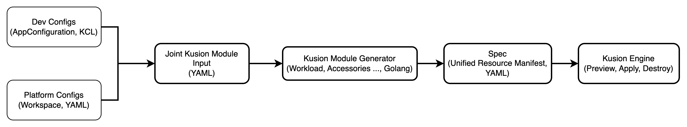
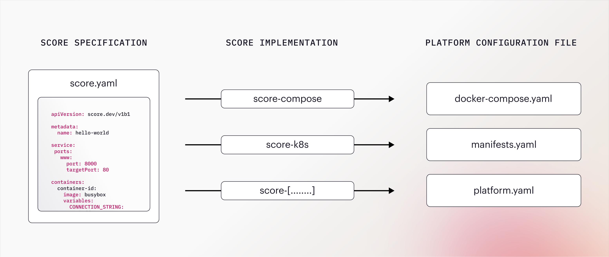
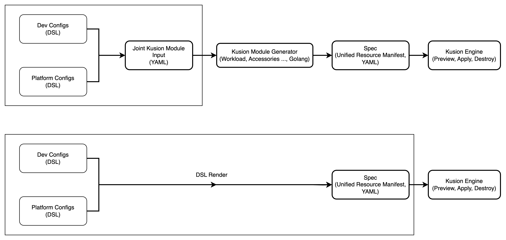

# Design Doc for the Connection of Kusion and Open-Source DSL

## Background

Currently, Kusion only supports defining and declaring the application configuration model, `AppConfiguration`, and Kusion module schema with `KCL`. However, as an open and intent-driven platform orchestrator, Kusion is not supposed to be tied to a specific Domain Specific Language (DSL). If Kusion could support other DSLs (such as `CUELang` and `PKL`, etc.) for application model and Kusion module schema definitions, as well as the module generator, it would bring more convenience for developers and also facilitate the integration of Kusion with other open-source ecosystems. 

## Goals and Non-Goals

### Golas

- Showcase the current Kusion operation workflow

- Showcase two investigated open-source products, `Timoni` and `Score`

- Propose a preliminary design for the connection of Kusion and open-source DSL, including how to define and declare the application model and Kusion module schema, as well as the implementation of Kusion module generator

### Non-Goals

- This design doc does not involve the specific code implementation details

- This design doc does not involve the discussions on how to support GPL other than `Golang` to implement a Kusion module generator

- This design doc does not involve the details of how to distribute the Kusion module artifacts

## Kusion Operation Workflow

As shown in the below, Kusion CLI will now take the `.k` files written by users in the `project/stack` directory and combine them with the `workspace` YAML configuration into a joint module input to send to the Kusion module generator, which will then execute the corresponding rendering logic based on the decalred `Workload` and `Accessories`, and eventually generating a `Spec` file. The Kusion engine actually consumes this unified application resource manifest to execute the `preview`, `apply` and `destroy` operation. 



## Timoni Module

A timoni module describes how an application can be customised and deployed on Kubernetes, using the CUE configuration language. A module is composed of a set of Kubernetes objects and a well-defined configuration schema. Besides the Kubernetes templates and config schema, a module can also specify how the lifecycle of the application should be managed, and how the application should be tested. 

Timoni requires a `timoni.cue` as the application configuraion entry point, which will define how Timoni should build, validate and apply the Kubernetes resources, below shows an example `timoni.cue` file. `timoni build` will use the CUE template to build an application instance with the resulting Kubernetes resources. 

```
package main

import (
	templates "timoni.sh/myapp/templates"
)

// Define the schema for the user-supplied values.
// At runtime, Timoni injects the supplied values
// and validates them according to the Config schema.
values: templates.#Config

timoni: {
	apiVersion: "v1alpha1"

	// Define the instance that outputs the Kubernetes resources.
	// At runtime, Timoni builds the instance and validates
	// the resulting resources according to their Kubernetes schema.
	instance: templates.#Instance & {
		// The user-supplied values are merged with the
		// default values at runtime by Timoni.
		config: values
		// These values are injected at runtime by Timoni.
		config: {
			metadata: {
				name:      string @tag(name)
				namespace: string @tag(namespace)
			}
			moduleVersion: string @tag(mv, var=moduleVersion)
			kubeVersion:   string @tag(kv, var=kubeVersion)
		}
	}

	// Pass Kubernetes resources outputted by the instance
	// to Timoni's multi-step apply.
	apply: app: [for obj in instance.objects {obj}]
}
```

## Score Specification

Score is an open-source, platform agnostic workload specification, aiming to reduce the developer toil and cognitive load by enabling the definition of a single file that works across multiple platforms. Take a simple `busybox` workload as an example: 

```yaml
apiVersion: score.dev/v1b1

metadata:
  name: hello-world

containers:
  hello:
    image: busybox
    command: ["/bin/sh"]
    args: ["-c", "while true; do echo Hello World!; sleep 5; done"]
```

Users can convert the `score.yaml` file into runnable `compose.yaml` and `manifest.yaml` with `score-compose` and `score-k8s` binary. And the generated configuration file can then be combined with environment-specific parameters to run the workload in the target environment. 



## Preliminary Design for the Connection of Kusion and Open-Source DSL

Analyzing the existing operation workflow of Kusion, we can find that a DSL has two main entry points into the Kusion workflow: 

- Define and declare the user and platform config codes with DSL, and convert them into the `Kusion Module Input`. Then we can reuse the existing Kusion module mechanism to generate the `Spec` file. 

- Define and declare the user and platform config codes with DSL, and convert them directly into the `Spec` file for Kusion engine to consume. 



Regardless of either of these two approaches, it seems to be hard to mix multiple DSLs, which means that the definition and declaration of the application model and Kusion module schema need to use the same DSL. 

And there are also two ways to convert the DSL code into the corresponding `Kusion Module Input` or `Spec` YAML file. The first is the approach adopted by Timoni, which integrates the DSL engine into the Kusion CLI, and the users' written configuration codes need to be able to compile into the target YAML file with the DSL engine. So that users can only interact with Kusion. While the second approach is adopted by Score, which provides users with some extra tools for DSL conversion. Users need to first develop and use the extra tool for DSL conversion, and then use the Kusion CLI for subsequent operations. 

Therefore, the alternative solution to integrate Kusion with DSL may be a combination of the above approaches. 

Furthermore, in order to support Kusion for DSLs other than `KCL`, the existing Kusion Module mechanism based on `KCL` should also be modified. 

<!-- TODO: The integration speculation based on CUE is ongoing.  -->
Take CUELang as an example. 
