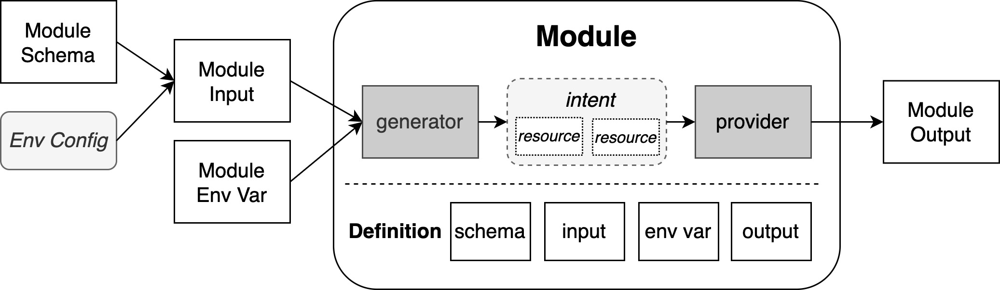

# Kusion Environment Management Proposal

## Context

Towards the version 0.10.0, Kusion is about to make a huge upgrade: the unambiguous definition of responsibility and collaboration paradigm between platform engineers and application developers through the application delivery process. The platform engineers firstly define modules and corresponding application-oriented schemas, where the latter constitute the application schema [AppConfiguration](https://www.kusionstack.io/docs/user_docs/config-walkthrough/overview#appconfiguration-model), and secondly initialize environments and corresponding configurations. The application developers select environment and fill in the fields of AppConfiguration. Then, executing the delivery action in a trusted environment, e.g. a CD pipeline, to apply the application intent from both the platform engineers and application developers. 

The upgrade explicitly the role of platform engineers and the concepts of **Module** and **Environment**. The Module is a building block enabling the delivery of a set of resources from **Schema Configuration** and **Environment Configuration**. While the Environment is a collection of application-independent configurations, and an environment configuration is composed of a set of module inputs, which forms the entire module inputs combined with schema configuration.

<br />

## Goals and Non-Goals

### Goals

1. Define the writing format of environment configurations;
2. Provide the commands to manage environments.

### Non-Goals

1. Only support local file based environment management, the support of other storage backends is not the goal of version 0.10.0. 

## Proposal

### Writing Format

The configuration of an environment should be maintained in a single yaml file, and the writing format and an example is shown as below.

```yaml
# Module input, with format standard：
# # module_<ModuleName>:
# #   default: # default configurations, applied to all projects
# #     <ModuleInput_Field1>: <value1>
# #     <ModuleInput_Field2>: <value2>
# #     ...
# #   <overrideGroupName>: # override configurations, applied to the projects assigned in projectSelector
# #     <ModuleInput_Field1>: <value1_Override>
# #     ... 
module_Database:
  default:
    provider: aws
    size: 20
    instanceClass: db.t3.micro
    securityIPs:
    - 10.0.0.0/18
  fooBar:
    size: 50
    instanceClass: db.t3.small
  baz:
    instanceClass: db.t3.large 

# Define the mapping between override configurations and projects, with format standard：
# # projectSelector:
# #   <ModuleName>:
# #     <overrideGroupName>:
# #     - <project1>
# #     - <project2>
# #   ... 
projectSelector:
  Database:
    fooBar:
    - foo
    - bar
    baz:
    - baz
```

The environment configuration file is composed of two types of blocks, and each block is a yaml dictionary:

- **Module Inputs**: The key is **module_\<ModuleName>**, and the value are a default and several override groups of module inputs, where the name of override group must not be default. For a certain group, the structure is also a yaml dictionary, and the key must be the module input field name.
- **Project Selector**:The key is **projectSelector**, and the structure of the value is a two layers' nested yaml dictionaries. The outer dictionary key is the module name, while the inner dictionary key is the override group name, and the value is the list of the projects using the override environment configurations. The project selector block contains the mapping of override groups and projects of all modules in an environment.

Following the writing format standard above, we can achieve:

- Clearly define the modules' inputs in an environment;
- Support customized configurations for some projects;
- Use a unify function to combine schema configurations and environment configurations to form the entire inputs for all modules. 

### Commands

Kusion provides the management of environment by sub command `kusion env`, the designed command is shown as below.

#### kusion env init <name>

Initialize an environment with specified name. An environment configuration file `<name>.yaml` in `$KUSION_HOME/.env` is created.

#### kusion env rm <name>

Remove an environment.

#### kusion env ls

List all the initialized environments.

#### kusion env edit <name>

Opens an editor to modify the specified environment configuration file.

#### kusion env set <name> [-f|--file \<file>] [\<key> \<value>]

Set the entire or the specified item of configuration of the specified environment. If setting the entire configuration, support from a file, while the specified key-value is forbidden. If setting the specified item, the item is a string which is the yaml object keys combined by dot, and the following is the example.

```sh
# set the field provider of module Database default input, environment name is dev
kusion env set dev module.Database.default.provider aws

# set the field size of module Database override fooBar input, environment name is dev
kusion env set dev module.Database.fooBar.size 50
```

#### kusion env get <name> [\<key>]

Get the entire of a specified item (if the key is specified) of the specified configuration.

#### kusion env validate <name>

Judge the environment configuration is valid or not.

## Q&A

**Q1**: Why there is a block named `projectSelector`, can it be written under the block `module_<ModuleName>`, like what is shown below?
```yaml
module_Database:
  default:
    provider: aws
    size: 20
    instanceClass: db.t3.micro
    securityIPs:
    - 10.0.0.0/18
  fooBar:
    size: 50
    instanceClass: db.t3.small
    projectSelector:
    - foo
    - bar
  baz:
    instanceClass: db.t3.large
    projectSelector:
    - baz  
```
**A1**: The format shown above can work, but there exists some drawbacks:

- projectSelector becomes a keyword, it asks for the module input filed name must not be projectSelector;
- projectSelector is at the same layer of the module input, which brings possible misunderstanding;
- Not obey 3NF of [Database normalization](https://en.wikipedia.org/wiki/Database_normalization), there are non-key columns (module input fields) depends on other non-key columns (projectSelector), which is not a good design for the possible database storage backend in the future.

**Q2**: How the AK, SK, KubeConfig, etc. get managed?

**A2**: AK, SK, KubeConfig are the sensitive data, which are the `module env var` in the picture shown in the section Contextm. Therefore, it should not be kept in a file, or any persistent storage without encryption. A module can be regraded as a function, which needs input and environment variables (not the kusion environment configurations) to generate the output. Platform engineers have to manage the environment configurations (part of the module inputs) and module environment variables. Manging environment variables is also the responsibility of platform engineers, but should be done manually.

**Q3**: If there are module inputs are the same in two or more environments, can they be imported or inherited?

**A3**: Under the product modality of kusion CLI and environment configuration file, "import" or "inherit" is not supported, cause the complexity it will introduce, just copy. If kusion has service layer, the reuse will be supported.

**Q4**: What validation does `kusion env validate` do?

**A4**: Only the format and the existence of reference (e.g., a non-existed override group name in projectSelector is not allowed) for now. But I think checking the correctness of the modules and their input field names is also important, e.g., if the module Database does not exist, the configuration of module_Database should be illegal. This asks for the module registry in kusion. The registry is natively done for built-in modules, but what for the future third-party modules? I think the registry should be done, and we can add the registry module correctness validation in the future.
