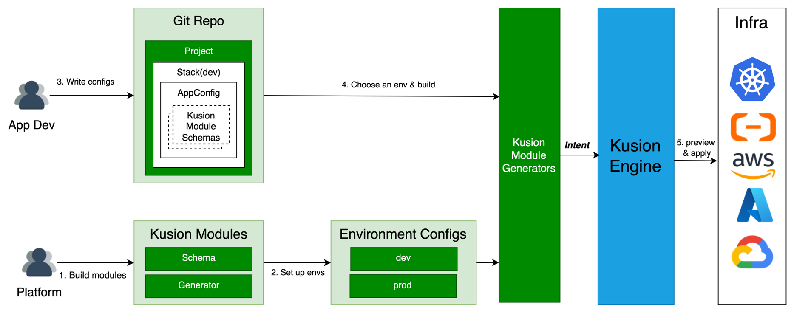
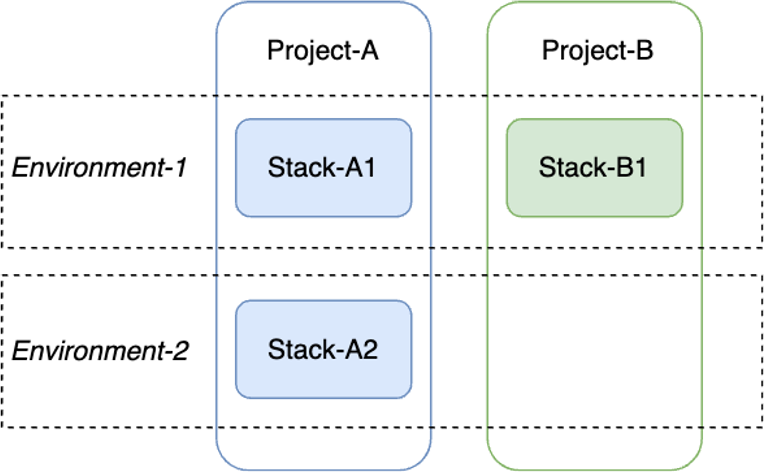

# Kusion Environment Management Proposal

## Context

Towards the version 0.10.0, Kusion is about to make a huge upgrade: the unambiguous definition of responsibility and collaboration paradigm between platform engineers and application developers through the application delivery process. The platform engineers firstly define modules and corresponding application-oriented schemas, where the latter constitute the application schema [AppConfiguration](https://www.kusionstack.io/docs/user_docs/config-walkthrough/overview#appconfiguration-model), and secondly initialize environments and corresponding configurations. The application developers select environment and fill in the fields of AppConfiguration. Then, executing the delivery action in a trusted environment, e.g. a CD pipeline, to apply the application intent from both the platform engineers and application developers. 

The upgrade defines the role of platform engineers and the concepts of **Module** and **Environment**. The Module is a building block enabling the delivery of a set of resources from **Schema Configuration** and **Environment Configuration**. While the Environment is a collection of application-independent configurations, and an environment configuration is composed of a set of module inputs, which forms the entire module inputs combined with schema configuration.

<br />

## Goals and Non-Goals

### Goals

1. Give the definition of environment; 
2. Define the writing format of environment configurations;
3. Provide the commands to manage environments;
4. Give the integration scheme with AppConfiguration when running `kusion build`.

### Non-Goals

1. Only support local file based environment management, the support of other storage backends is not the goal of version 0.10.0;
2. Only consider using Kusion in CLI format, the usage of service layer is not considered.

## Proposal

### Definition

Environment is a logical concept representing a target that a stack will be deployed to, which contains a set of configurations, kubeconfig and provider authentication information that can be reused by multiple stacks. We recommend environments grouped by SDLC phases or cloud vendors. For example, it could be named as dev, staging, and prod or cloud vendors such as AWS, Azure, and Aliyun.

At the product level, Kusion does not support multiple clouds or multiple regions in an environment. Although users can define an artful module which builds a schema into multiple resources in multiple clouds or regions. Kusion cannot forbid such modules, but doesn't recommend it and will not provide supportive technical means of multiple clouds or region in an environment. If a platform team needs to manage multiple clouds or regions, just create multiple environments. 

Environment config are kept by yaml file when stored locally, and only includes a set of module inputs for now. But it may include other data, such as backend, which is not appropriate to set in the configuration file. There are two reasons: 1. backend info is a global config rather than environment config; 2. backend info includes sensitive data, such as database password.

The kubeconfig and provider authentication information are kept by environment variables, cause the existence of sensitive data. For example, using AWS must set correct environment variables of `AWS_ACCESS_KEY_ID`, `AWS_SECRET_ACCESS_KEY` and `AWS_REGION`.

According to [Building the collaboration paradigm between App Developers and Platform Developers with Kusion.md](https://github.com/KusionStack/kusion/blob/main/docs/design/collaboration/Building%20the%20collaboration%20paradigm%20between%20App%20Developers%20and%20Platform%20Developers%20with%20Kusion.md), *a stack must be linked with one environment*. The stack name must be the same as the environment name it will deploy to.

<br />

### Environment Config File Format

The configuration of an environment should be maintained in a single yaml file, and the writing format and an example is shown as below.

```yaml
# Module input, with format standard：
# # <ModuleName>:
# #   default: # default configurations, applied to all projects
# #     <ModuleInput_Field1>: <value1>
# #     <ModuleInput_Field2>: <value2>
# #     ...
# #   <patcherName>: #patcher configurations, applied to the projects assigned in projectSelector
# #     <ModuleInput_Field1>: <value1_Override>
# #     ...
# #     projectSelector:
# #     - <projectName1>
# #     ...
module:
  database:
    default:
      provider: aws
      size: 20
      instanceClass: db.t3.micro
      securityIPs:
      - 10.0.0.0/18
    smallClass:
      size: 50
      instanceClass: db.t3.small
      projectSelector:
      - foo
      - bar
    largeClass:
      instanceClass: db.t3.large
      projectSelector:
      - foo
      - bar
```

The environment configuration file only includes module configs for now, whose key is `module`, and value is a yaml dictionary containing specified module configs whose key is the module name.

A module config is composed of a default configs and several patchers, where the name of patcher must not be default. For default config or a certain patcher, the structure is also a yaml dictionary, and the key must be the module input field name.

Following the writing format standard above, we can achieve:

- Clearly define the modules' inputs in an environment;
- Support customized configurations for some projects;
- Use a unify function to combine schema configurations and environment configurations to form the entire inputs for all modules. 

### Commands

Kusion provides the management of environment by sub command `kusion env`, the designed command is shown as below.

#### kusion env create \<name> -f \<configFilePath>

Create an environment.

#### kusion env update \<name> -f \<configFilePath>

Create an environment configuration.

#### kusion env delete \<name>

Delete an environment configuration.

#### kusion env list 

List all the initialized environments.

#### kusion env show \<name>

Show the configurations of specified environment.

There are the user cases:

- **Individual developer**: The user creates environments as needed (e.g. dev, pre and prod), and writes AppConfiguration codes in corresponding project and stacks locally. When applying a specified stack, set kubeconfig and provider authentication info, and corresponding environment configurations are used automatically to build intent.
- **Collaboration Scenario**: An application developer gets the names of environments in use, then write project and stack AppConfiguration codes locally, with stack name the same as environment name. In CI/CD pipeline, create environments according to the changed stacks, set kubeconfig and provider authentication info, then apply a specified stack. In this scenario, the full environment configurations should be stored by platform team for now. After the support of centralized storage backend, the storage work of environment configuration can be handled by Kusion.

Limited by the Kusion CLI format, in the collaboration scenario, application developers cannot list the environments platform teams provide, cause kusion is not a long-running service. Even though there is the support of the centralized storage, such as db, application developers cannot list environments through CLI either, cause the db password is kept by platform team and should not expose to an application developer. If there was service layer, we can do more things!

### Integration with AppConfiguration to Build Intent

When calling `kusion build`, do the following two things to interact with environment configurations:

1. Get the corresponding environment configurations according to stack name;
2. Inject the module inputs specified in the environment config to construct the full module input before calling `Gnerate`, which will be called in the funtion `CallGenerators` to avoid manually call for every generator.

The definition of `Generator` need update to assign the Module that the generator uses. Compared to the R&D progress of generator for now, the only one thing need change is to add a `Module` function.  

```Go
// Generator is the interface that wraps the Generate method.
type Generator interface {
	Generate(spec *models.Spec) error
	
	// Module that the Generator uses, [new added]
	Module() any
}

// take database for an example

type databaseGenerator struct {
    project  *projectstack.Project
    stack    *projectstack.Stack
    appName  string
    workload *workload.Workload
    database *database.Database
}

func (g *databaseGenerator) Module() any {
	return g.database
}

func (g *databaseGenerator) Generate(spec *models.Spec) error {...}
```