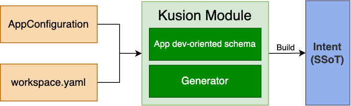

# Kusion Module Design Doc

## Definition

Kusion module is a reusable building block of KusionStack designed by platform engineers. Here are some explanations to make the definition more clear:

1. It represents an independent unit that provides a specific capability to the application with clear business semantics.
2. It consists of one or multiple infrastructure resources (K8s/Terraform resources), but it is not merely a collection of unrelated resources. For instance, a database, monitoring capabilities, and network access are typical Kusion Modules.
3. Modules should not have dependencies or be nested within each other.
4. AppConfig is not a Module.

For more details, please visit our [official website](https://www.kusionstack.io/docs/kusion/concepts/kusion-module).



## Goals

1. Design a flexible Kusion module mechanism to manage and use modules
2. Provide a user-friendly framework to enable users to develop customized modules

## Modules in AppConfiguration

```python
import kam.v1 as ac
import kam.v1.workload as wl
import kam.v1.workload.container as c
import kam.v1.workload.container.probe as p
import monitoring as m
import database as d

# Note: AppConfiguration per se is not a Kusion Module
  helloWorld: ac.AppConfiguration {
      # Built-in module
      workload: wl.Service {
          containers: {
              "main": c.Container {
                  image: "ghcr.io/kusion-stack/samples/helloworld:latest"
                  # Configure a HTTP readiness probe
                  readinessProbe: p.Probe {
                      probeHandler: p.Http {
                          url: "http://localhost:80"
                      }
                  }
              }
          }
      }

      # a collection of accessories that will be attached to the workload
      accessories: {
       # Built-in module
         "my-database" : d.MySQL {
          type: "cloud"
          version: "8.0"
         }
         # Built-in module
         "my-prometheus" : m.Prometheus {
          path: "/metrics"
         }
         # Customized module
         "my-customize": customizedModule {
           ...
         }
      }
  }
```

## Structure

An app dev-orient schema, a generator and a license file are three components required for a legal Kusion module. We strongly recommend adding a readme file and examples in the module package for completeness. An example module package is shown as follows.

```shell
$ tree example-module/
.
├── schema.k
├── kusion-module-name_0.1.0 # binary
├── kcl.mod
├── README.md
├── LICENSE
├── example
│ ├── dev
│ │ ├── example.k
│ │ ├── kcl.mod
| | ├── workspace.yaml
│ │ └── stack.yaml
│ └── project.yaml
``` 

## Lifecycle

### Execution lifecycle

#### Download and unzip

A complete set of modules of one stack consists of two parts: modules in the AppConfig and modules in the workspace. In most scenes, the two parts are the same, but we also support one module **do not contain schemas**.
During executing the command `kusion generate`, Kusion will download modules described in the AppConfiguration and `workspace.yaml` by reusing the download logic of KPM. After that Kusion should unzip the package and move the module binary to `$KUSION_HOME/modules`.

#### Build the Spec

All KCL codes written by app devs will be compiled by KPM and output an intermediate YAML. Kusion combines this YAML and corresponding workspace configurations as inputs of Kusion module generators and invokes these generators to get the final [Spec](https://www.kusionstack.io/docs/kusion/concepts/spec).

##### Generator Interface

Kusion invokes all module generators described through gRPC with [go-plugin](https://github.com/hashicorp/go-plugin) and provides a framework to deserialize and validate input and output values to guarantee correctness. Interfaces are defined below.

```protobuf
// GeneratorRequest represents a request to generate something based on the project details
message GeneratorRequest {
  // Project represents the project name
  string project = 1;
  // Stack represents the stack name
  string stack = 2;
  // App represents the application name, which is typically the same as the namespace of Kubernetes resources
  string app = 3;
  // Workload represents the v1.Workload defined in the AppConfiguration
  bytes workload = 4;
  // DevModuleConfig is the developer's inputs of this module
  bytes dev_module_config = 5;
  // PlatformModuleConfig is the platform engineer's inputs of this module
  bytes platform_module_config = 6;
}

// GeneratorResponse represents the generate result of the generator.
message GeneratorResponse {
  // Resource is a v1.Resource array, which represents the generated resources by this module.
  repeated bytes resources = 1;
  // Patcher contains fields should be patched into the workload corresponding fields
  repeated bytes patchers = 2;
}

service Module {
  rpc Generate(GeneratorRequest) returns (GeneratorResponse);
}
```

```go
// Patcher contains fields should be patched into the workload corresponding fields
type Patcher struct{
 Environments map[string]string `json:"environments" yaml:"environments"`
 Labels map[string]string `json:"labels" yaml:"labels"`
 Annotations map[string]string `json:"annotations" yaml:"annotations"`
 ...
} 
```

Considering workload is required for every application and other modules depend on it, Kusion will execute the `workload` module at first to generate the workload resource. For modules that need to modify attributes in the `workload` such as environments, labels and annotations, we introduce a `patch` mechanism to fulfill this demand. The `Generate` interface returns two values `Resources` and `Patchers`. Kusion will append resources to the Spec and parse patchers to patch the workload corresponding fields.

### Clean up

Close all connections with one module once it has been executed.

## Develop lifecycle

### Set up a developing environment

Developing a Kusion module includes defining a KCL schema and developing a Go project. We will provide a scaffold repository and a new command `kusion mod init` to help developers set up the developing environment easily.

After executing the command `kusion mod init`, Kusion will download a scaffold repository and rename this project with your module name. The scaffold contains code templates and all files needed for developing a Kusion module. The structure looks like this:

```shell
$ tree example-module/
.
├── example
│ ├── dev
│ │ ├── example.k
│ │ ├── kcl.mod
│ │ └── stack.yaml
│ └── project.yaml
├── kcl.mod
├── example_module_schema.k
└── src
    ├── Makefile
    ├── go.mod
    ├── go.sum
    ├── example_module.go
    └── example_module_test.go
```

### Developing

As a platform engineer, the workflow of developing a Kusion module looks like this:

1. Communicate with app developers and identify the fields that should exposed to app developers in the dev-orient schema
2. Identify module input parameters should configured by platform engineers and initialized in the `workspace.yaml`
3. Define the app dev-orient schema
4. Develop the module plugin by implementing gRPC interfaces

### Local validation

Build your module code into a binary and copy it to the corresponding path in `$KUSION_HOME/modules`, and then you can validate your module with the command `kusion generate`.

### Publish

Publish the Kusion module to a registry with the command `kusion mod push`

## Relationship


## An open question -- How to manage on-prem infrastructures

According to the definition of the Kusion module, it is responsible for generating the Spec and passing it to the Kusion engine to make it active. For cloud resources and Kubernetes, we currently leverage Terraform providers and Kubernetes operators to manage these resources effectively. But for platform engineers who want to manage their on-premises infrastructures with Kusion, what are they supposed to do? Here are two methods.

1. Obviously, platform engineers can develop a Kubernetes operator or a Terraform provider, along with an associated Kusion module, and then publish it to a provider or Helm registry. However, this workflow is too fragmented and they have to maintain two separate logics with completely different workflows.
2. Extending the functionality of Kusion modules to include the logic for operating actual infrastructures. This would unify the development experience by providing a complete building block, including definition and execution.

The second method raises the question of whether Kusion module should be compatible with existing Terraform providers or Kubernetes operators. If compatibility is desired, we could develop an adapter or a shim to convert Terraform providers into Kusion modules. We have seen some projects have done this before, but such an adapter would be very complex and challenging to catch up with the upstream Terraform provider framework.

We are still considering this question. Any suggestions or ideas are welcome, please feel free to open an issue or a discussion in our repository.