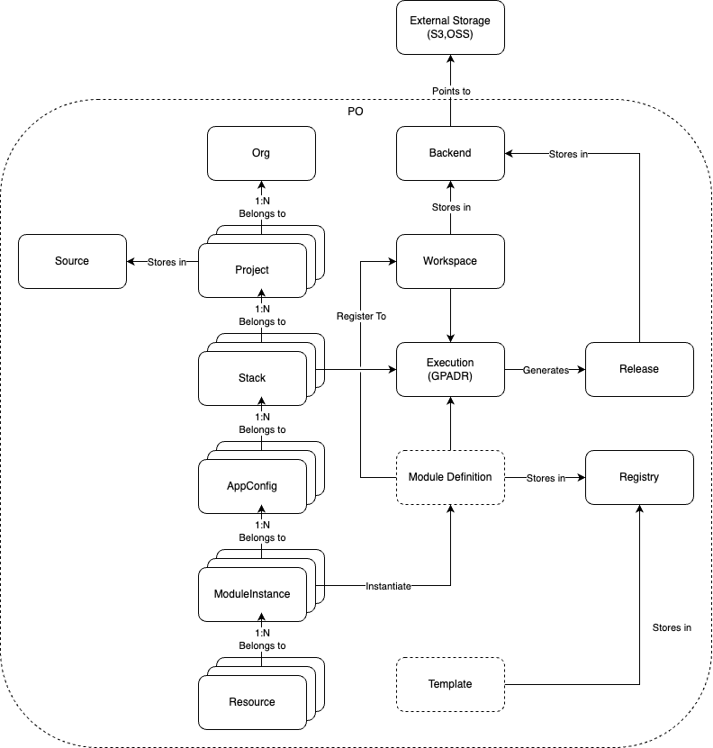
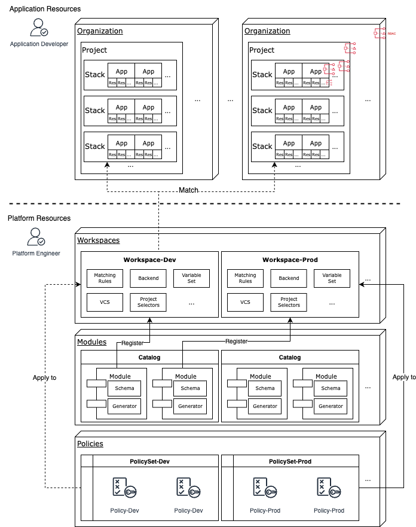
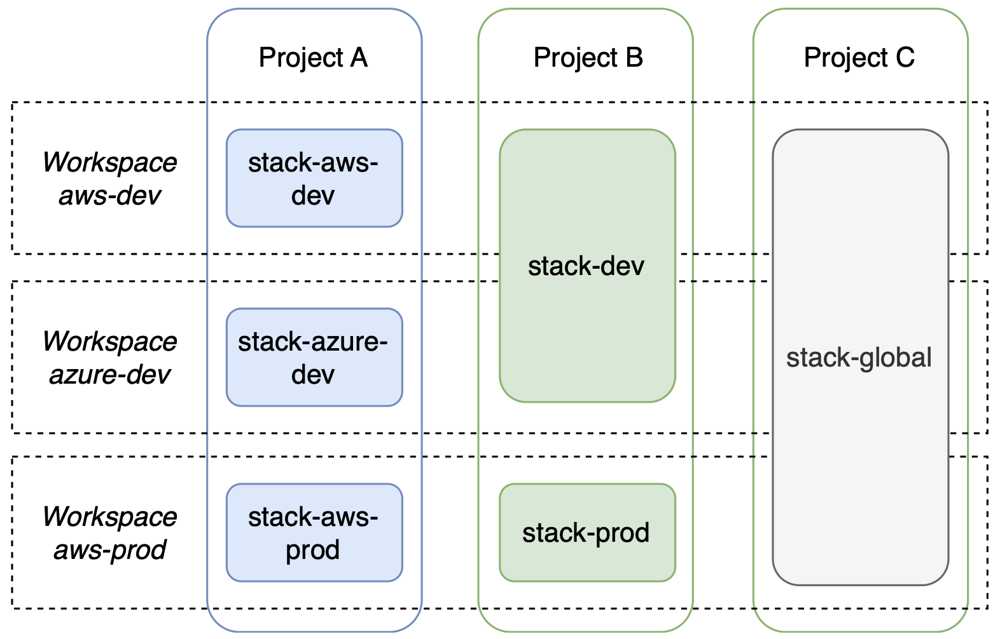

# Kusion Server Design Doc

# Table of Content
- [Abstract](#abstract)
- [Background](#background)
- [Goals and Non-Goals](#goals-and-non-goals)
    - [Goals](#goals)
    - [Non-goals](#non-goals)
- [Concepts](#concepts)
= [Core Domain Models](#core-domain-models)
    - [Model Hierarchy](#model-hierarchy)
    - [Separation of Application Resources and Platform Resources](#separation-of-application-resources-and-platform-resources)
- [Core Capabilities and APIs](#core-capabilities-and-apis)
    - [Organization Management](#organization-management)
        - [Organizations](#organizations)
        - [Roles and Assignments](#roles-and-assignments)
    - [Application Management](#application-management)
        - [Projects](#project)
        - [Stacks](#stack)
    - [Platform Configuration](#platform-configuration)
        - [Backends](#backend)
        - [Workspaces](#workspace)
        - [Variable Sets (Optional)](#variable-sets-optional)
        - [Matching Rules (Optional)](#matching-rules-optional)
    - [GitOps Management](#gitops-management)
        - [Source](#source)
    - [Resource Management](#resource-management)
        - [Resource](#resource)
    - [Modules Management (Coming Soon)](#modules-management-coming-soon)
    - [Workflow Management (Coming Soon)](#workflow-management-coming-soon)
    - [Policy Management (Coming Soon)](#policy-management-coming-soon)


# Abstract

This document captures the design details for Kusion 2.0, a.k.a Kusion with a Control Plane, or Kusion Server.

# Background

KusionStack is a Platform Engineering tech stack that is set to enable platform owners to build their tailored IDPs.

Kusion today serves as a Command Line Interface (CLI) tool that functions as an Intent-Driven Platform Orchestrator. Kusion proposes a protocol-driven collaboration paradigm which includes the platform owners and application developers to each do their jobs separately, and then have Kusion perform the orchestration work to dynamically match and generate the final and infrastructure-facing specification (in Kusion's term, this is called a `spec`), which eventually gets applied by Kusion.

However, this form of Kusion is limited in its ability to provider service at scale, where users are facing issues such credentials management, resource visibility, complexity in managing permissions, and effort to integrate with other systems etc.

With that background, we are proposing Kusion 2.0 which is a form of Kusion that runs as a long-running service and exposes REST service endpoints.

# Goals and Non-Goals

## Goals

- Kusion server is primarily targeting collaboration scenario (between application dev and platform engineers) at scale
- Kusion server should provide universal APIs that covers the entire lifecycle of an application delivery and operations
- Kusion server should provide RBAC based on identities, which includes user identities and system identities
- Kusion server should primarily recommend and use the GitOps-driven workflow
- Kusion server should expand the domain models in Kusion CLI to provide value-add capabilities such as the ability to persist resource status and construct a topological graph to which the application is deployed
- Kusion server should follow the same design principles of Kusion, which will be elaborated in the next section

## Non-goals

- Kusion server is not a resource manager in a sense that it should not directly manipulate resources. Instead, it relies on users to update configuration files (either application or platform configurations).
- Kusion server does not provide configuration management capabilities, a.k.a the ability to modify intent or spec files. The management of such files should be the responsibility of the users at the moment.
- Kusion server does not consider procedure operations such as "restarting a pod", or "scale up my database", etc. as part its scope at the moment.

# Concepts

- Platform Orchestrator: According to [internaldeveloperplatform.org](https://internaldeveloperplatform.org/platform-orchestrators/), a Platform Orchestrator is defined as "a new generation of tools that go beyond the traditional platform-as-a-service (PaaS) model and offer published contracts between developers and platform teams. The contract might involve provisioning cloud environments, databases, monitoring, authentication and more in a different environment. These tools enforce organizational standards while granting developers self-service access to variations through configuration". In the context of Kusion, it follows several stages while achieving that: Read -> Match -> Create -> Deploy -> Day-2 Operations.

For other Kusion-native concepts, please refer to the [Kusion Concept Doc](https://www.kusionstack.io/docs/concepts/project/overview).

# Core Domain Models
## Model Hierarchy


## Separation of Application Resources and Platform Resources


# Core Capabilities and APIs
## Organization Management
- `Organization` represents a virtual entity that contains a collection of Projects that belongs together logically
- Usually this maps to a real software engineering organization, such as teams, departments, business units or business groups, etc.
- Deleting an organization deletes all projects in that organization
- Authorizing to a subject to an organization grants it permission to all projects in that organization

### Organizations
#### Proposed Organizations APIs
```
# CRUDL
POST /api/v1/orgs # Create an org
GET /api/v1/orgs/{orgID} # Read an org
PUT /api/v1/orgs/{orgID} # Update an org
DELETE /api/v1/orgs/{orgID} # Delete an org
GET /api/v1/orgs # List all orgs
```

#### Parameters

| Parameters | Required | Unique Key | Description |
| -------- | ------- | -------- | ------- |
| Name | true | true | organization name |
| Description | false | false | organization description |
| Labels | false | false | organization labels |
| Owners | false | false | organization owners |

#### Sample Payload: 
```
{
    "name": "ffforest-org",
    "owners": ["forest"]
}
```

### Roles and Assignments
- Organization owners shoud be responsible for managing roles and role assignments in its org
- Detailed API design coming soon

## Application Management
### Project
- `Project` generally represents an application that serves a business purpose. It may encapsulates one or more micro-services. 
- The purpose of the project is to bundle application configurations there are relevant. Specifically, it organizes configurations for internal components that orchestrate the application
- A `Project` must belong to an `Organization`
- A `Project` must have a `Source` that points to where its configurations are stored

#### Proposed Project APIs
```
# CRUDL
POST /api/v1/project # Create a project
GET /api/v1/project/{projectID} # Read a project
PUT /api/v1/project/{projectID} # Update a project
DELETE /api/v1/project/{projectID} # Delete a project
GET /api/v1/project # List all projects
GET /api/v1/project?org=xxx # List all projects in an org
```

#### Parameters

| Parameters | Required | Unique Key | Description |
| -------- | ------- | -------- | ------- |
| Name | true | true | project name |
| SourceID | true | false | source ID where project configuration is stored |
| OrganizationID | true | false | organization ID where project belongs to |
| Path | true | false | project path in the source |
| Description | false | false | project description |
| Labels | false | false | project labels |
| Owners | false | false | project owners |
| TemplateID(?) | false | false | project template ID |

#### Sample Payload
```
{
    "name": "forest-simple-service-4",
    "path": "simple-service-4",
    "organizationID": "1",
    "sourceID": "1"
}
```

### Stack
- `Stack` is a configuration instance of an project. It represents a way to distinctly manage different configurations in the same project
- The recommended way is to use the abstract concept of an `environment` to name stacks, such as `dev`, `stage`, `prod`, etc., because _generally_ there are some configuration differences in each `environment`, such as environment variables
- However if ther are not, you can absolutely store all of them in one stack (such as `base`)
- One stack can be deployed to multiple `environments`, or in Kusion's term, `workspaces`
- A `Stack` DOES NOT necessarily represent the application instance in a given environment. It only represents a set of different application configuration
- `Environment` or `Workspace` is a deploy-time concept, whereas `stack` is a config-time concept
- A `Stack` must belong to a `Project`
- A `Stack` does not equal to `a project in a workspace`
- A `Stack` is a minimum unit of operation to write (Create+Update+Delete) or execute (Preview+Apply+Destroy)

#### Proposed Stack APIs
```
# CRUDL
POST /api/v1/stack # Create a stack
GET /api/v1/stack/{stackID} # Read a stack
PUT /api/v1/stack/{stackID} # Update a stack
DELETE /api/v1/stack/{stackID} # Delete a stack
GET /api/v1/stack # List all stacks
GET /api/v1/stack?project=xxx # List all stacks in a project
GET /api/v1/stack?org=xxx&project=xxx # List all stacks in a project in an org

# Execute 
POST /api/v1/stack/{stackID}/generate # Generate specs for a stack
POST /api/v1/stack/{stackID}/preview # Preview changes for a stack
POST /api/v1/stack/{stackID}/apply # Apply resources for a stack
POST /api/v1/stack/{stackID}/destroy # Destroy resources for a stack
POST /api/v1/stack/{stackID}/generate?cell=xxx&aig=xxx # Generate 

# Release
GET /api/v1/stack/{stackID}/release # List all releases for this stack
GET /api/v1/stack/{stackID}/release?workspace=dev # List all release for this stack in dev workspace
POST /api/v1/stack/{stackID}/rollback
```

#### Parameters

| Parameters | Required | Unique Key | Description |
| -------- | ------- | -------- | ------- |
| Name | true | true | stack name |
| ProjectID | true | false | project ID where stack belongs to |
| Path | true | false | stack path in the source |
| Description | false | false | stack description |
| Labels | false | false | stack labels |
| Owners | false | false | stack owners |
| TemplateID(?) | false | false | stack template ID |

#### Sample Payload
```
{
    "name": "forest-simple-service-dev-2",
    "path": "simple-service/dev-4",
    "desiredVersion": "latest",
    "projectID": "5"
}
```

#### Sample Request
```
curl http://localhost:8888/api/v1/stack/1/generate?workspace=dev # this generates a new spec for dev workspace
curl http://localhost:8888/api/v1/stack/{stackID}/rollback?workspace=dev&releaseID=xxx # this rolls back a stack to one of its previous release
```

## Platform Configuration

### Backend
- A `Backend` represents a storage backend for Kusion server to store structured data, such as workspace configurations (in the form of `workspace.yaml`) or releases (including `spec` and `state`)
- Supports AWS S3, AliCloud OSS and local storage currently

#### Proposed Backend APIs
```
# CRUDL
POST /api/v1/backend # Create a backend
GET /api/v1/backend/{backendID} # Read a backend
PUT /api/v1/backend/{backendID} # Update a backend
DELETE /api/v1/backend/{backendID} # Delete a backend
GET /api/v1/backend # List all backends
```

#### Parameters
| Parameters | Required | Unique Key | Description |
| -------- | ------- | -------- | ------- |
| Name | true | true | backend name |
| BackendConfig | true | false | backend configurations including AccessKey and SecretKey |
| Description | false | false | workspace description |
| Labels | false | false | workspace labels |
| Owners | false | false | workspace owners |

#### Sample Payload
```
{
    "name": "oss-backend-7",
    "description": "oss backend 7",
    "backendConfig": {
        "type": "oss",
        "configs": {
            "accessKey": "ak7",
            "secretKey": "sk7"
        }
    }
}
```

### Workspace
- A `Workspace` represents a specific landing zone. It is a deploy-time concept, as opposed to `stack` being a config-time concept
- It is a logical concept that maps to an actual target environment to deploy a stack to. In today's context, this usually represents a Kubernetes cluster for the application workload and an optional cloud account to provision infrastructure resources that the workload depends on (A database, for example)
- Aside from the deployment destination, workspaces are also designed to be associated with a series of platform configurations that are used by all the stacks deployed to said workspace
- Workspaces should be managed by Platform Engineers, and selected by developers (or whoever is in charge of the app delivery)



#### Proposed Workspace APIs
```
# CRUDL
POST /api/v1/workspace # Create a workspace
GET /api/v1/workspace/{workspaceID} # Read a workspace
PUT /api/v1/workspace/{workspaceID} # Update a workspace
DELETE /api/v1/workspace/{workspaceID} # Delete a workspace
GET /api/v1/workspace # List all workspaces
```

#### Parameters

| Parameters | Required | Unique Key | Description |
| -------- | ------- | -------- | ------- |
| Name | true | true | workspace name |
| BackendID | true | false | backend ID to store workspace configuration and releases |
| Description | false | false | workspace description |
| Labels | false | false | workspace labels |
| Owners | false | false | workspace owners |

#### Sample Payload

```
{
    "name": "aws-us-east-1-prod",
    "backendID": "7",
    "owners": ["forest"]
}
```

### Variable Sets (Optional)
- Variable Sets are places to store variables used as part of the `kusion` workflow
- This provides an alternative way to store platform configurations
- It is also responsible for managing secrets and credentials, especially those that are on the platform level
- Detailed API design coming soon

### Matching Rules (Optional)
- Matching Rule provides an alternative approach to "select" stacks based on rules configured on the workspace level
- The purpose is to lower developers' burden to be aware of the concept of workspaces
- Matching Rules can centrally manage all the matching logic between application configuration and platform configuration 

## GitOps Management

### Source

#### Proposed Source API
```
# CRUDL
POST /api/v1/source # Create a source
GET /api/v1/source/{sourceID} # Read a source
PUT /api/v1/source/{sourceID} # Update a source
DELETE /api/v1/source/{sourceID} # Delete a source
GET /api/v1/source # List all sources
```

#### Parameters

| Parameters | Required | Unique Key | Description |
| -------- | ------- | -------- | ------- |
| SourceProvider | true | true | source provider type, supports git and oci |
| Remote | true | true | source remote, usually an url |
| Description | false | false | source description |
| Labels | false | false | source labels |
| Owners | false | false | source owners |

#### Sample Payload
```
{
    "name": "ffforest-github",
    "sourceProvider": "git",
    "remote": "https://github.com/ffforest/kcp-samples.git",
    "description": "KCP samples in ffforest github"
}
```

## Resource Management

### Resource
- `Resource` here represents the actual resources that are applied via Kusion server
- Kusion server should record its status **at apply time, after it has succeeded**, but NOT to serve as a proxy to cloud provider APIs afterwards to get real-time status in Day-2
- The purpose is to persist resources that are managed under a given org, project, stack (or smaller granularities), in order to generate a topological view to which an application has been deployed
- This application resource graph can also be used for IAM authorization purposes if need be
- Kusion server should produce a mapping between Kusion resource ID and infrastructure resource ID, including cloud resource identifiers (such as ARNs) or Kubernetes resource identifiers (GVK+namespace+name)
- Kusion server should be able to import existing cloud resources so that it can manage infrastructures that already exists. This is done by passing the cloud resource ID into a field in the `extension` in Kusion specs

#### Proposed Resource APIs
```
# Resource RL
GET /api/v1/resource/{resourceID} # Read a resource
GET /api/v1/resource # List all resources
GET /api/v1/resource?moduleinstance=xxx # List all resources in a module
GET /api/v1/resource?appconfig=xxx # List all resources in an appconfig
GET /api/v1/resource?stack=xxx # List all resources in a stack
```

## Modules Management (Coming Soon)
- A Kusion Module is a reusable building block designed by platform engineers to standardize application deployments and enable app developers to self-service
- Kusion server provide basic APIs for managing Kusion Modules that can be used by Kusion server
- This should include the ability to publish and register Kusion Modules

## Workflow Management (Coming Soon)
- This provides workflow execution records which are necessary for audits
- Kusion server should have built-in approval and notifications mechanism

### Release
- Release are automatically generated after a successful apply, with a combination of `Spec` and `State`
- Detailed API design coming soon

## Policy Management (Coming Soon)
- This should include render-time policy (during `kusion generate`) and apply-time policy (during `kusion apply`)
- Policy should have an effective range: which orgs/projects/stacks does this policy set apply to?