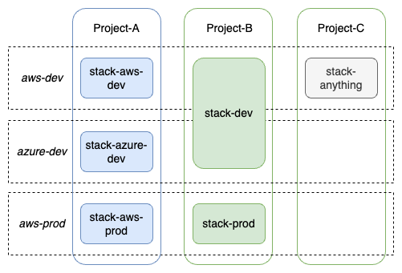

# Kusion's Multi-cloud strategy

## Table of Content
- [Purpose](#purpose)
- [Background and motivation](#background-and-motivation)
- [Scope](#scope)
- [Proposal](#proposal)
    - [Roles and Responsibilities](#roles-and-responsibilities)
    - [Points of abstraction](#points-of-abstraction)
        - [Single product abstraction](#single-product-abstraction)
        - [Multi-cloud abstraction](#multi-cloud-abstraction)
            - [Separation of concern](#separation-of-concern)
        - [Basis for multi-cloud abstraction](#basis-for-multi-cloud-abstraction)
        - [Managing Snowflakes](#managing-snowflakes)
    - [Managing multi-cloud topology](#managing-multi-cloud-topology)
- [Appendix](#appendix)

## Purpose 
This document captures the ideology and methodology Kusion adopts to support applications running on multiple public cloud service providers. It also retraces the thought process and explains the reasoning behind any decision making.

## Background and motivation
Multi-cloud is a growing requirement for certain if not most of software engineering organizations for a variety of reasons:
- Business Continuity and Disaster Recovery
- Regulation and Compliance
- Pricing Flexibility
- Avoiding Vendor Lock-in
- Business Requirements (such as low latency in a specific vendor region)

Kusion has a vision for:
- A unified workflow for application delivery
- One-stop-shop application bootstrapping
- Write (configuration) once, deliver everywhere

To achieve that, We are motivated to define a paradigm that highlights collaborations between different parts of the software organizations and enables developer self-service as much as possible, to get to a mature level of standardization and efficiency in application delivery into any infrastructure provider.

## Scope
The scope of Kusion's multi-cloud strategy is to ensure Kusion-managed application delivery can be made onto multiple public cloud providers. This includes cloud resource provisioning, workload management and application bootstrapping. This document focuses on the configurations that drive cloud resource provisioning.

Kusion's tooling is platform agnostic by design. The multi-cloud support does NOT intend to change that. Kusion provides a plugin mechanism via the concept of application-facing [models](https://kusionstack.io/docs/user_docs/reference/model/overview/), which is the cornerstone of Kusion's extensibility. This proposed design explore possibilities on how this model can be fine-tuned to support multi-cloud, while still honoring Kusion's commitment to lower developer's cognitive burden and self-service ability.

## Proposal

We can break the exploration down into two steps:
1. Understand the scope of the cloud resources that covers popular application delivery needs
2. Identify the points for abstraction and how the approach fit into Kusion's collaboration model
3. Mapping 

To better understand the problem statement, we can first take a look at some of the most frequently used cloud resources that are scoped to an application (as opposed to the infrastructure resources shared among different applications). The detailed list can be found in the [Appendix](#appendix) section.

### Roles and Responsibilities
The following proposal assumes existence of the following roles and their responsibilities:
- **Application Developers** should care about the ones related to the **business logic**. Example: Database Engine, Version, etc
- **Platform Developers** should care about the **standardized platform-wide** configurations that enforces infrastructure best practices on a platform level. Example: Security, Compliance or Business Continuity related configs.

### Points of abstraction
Proper levels of abstraction provides value by hiding the unnecessary details to reduce complexity perceived by the end user.

Before diving into this proposition, we can define it more granularly by identifying the different layers of abstraction Kusion can provide that are independent of each other:
- We could abstract any single cloud product by eliminating the configurations that aren't frequently used or those that require standardization, thereby minimizing the amount of information exposed to the end users to provision a single product on the happy path.
- We could abstract similar cloud products on different vendors by grouping well-known concepts that are alike, therefore reducing the cognitive burden on the end users across multiple cloud vendors.

#### Single product abstraction
The former should be relatively easier to achieve. Kusion leverages terraform provider for cloud resources almost entirely. In that context, for any given cloud product, we should be able to cut through terraform provider's abundance of configurations and filter out the ones that are used at a high frequency. However, abstraction typically comes at a price. By eliminating the less-frequently used configurations, we are also effectively eliminating the ability to configure some capabilities of that cloud product.

The philosophy behind this conscious design decision is to reduce the cognitive burden for a single product for the majority of the end users (by hiding the complexity of less-used configs), with the disclaimer that this is not a silver bullet, but rather our best-effort attempt on what we believe to be the balance between flexibility and convenience. For the abstraction to work in each different organization, it might require some customization and continuous tweaking based on distinct needs of the org.

#### Multi-cloud abstraction
Single product abstraction can significantly reduce complexity for a single cloud product. However it doesn't solve the problem where application team need to deploy to more than one public cloud.

The philosophy behind multi-cloud abstraction is to only expose concepts that are vendor-neutral and development-relevant (such as `Database`, `Storage`, `Cache`, `database engine`, `version`, etc) to the application developers, and leave the rest and the majority of the vendor-specific configurations to the platform team.

Let's take a look at an example.

Without multi-cloud abstraction, the configuration for a `MySQL v5.7` database on AWS and AliCloud looks like the following:
```
    # Represents an AWS RDS Database
    database: db.AWS_RDS_Database {
        engine: "MySQL"
        version: "5.7"
        size: 20
        instanceClass: "db.t3.micro"
        ...
    }
    # Represents an AliCloud RDS Database
    database: db.AliCloud_RDS_Database {
        engine: "MySQL"
        version: "5.7"
        size: 20
        instanceClass: "mysql.n2.serverless.1c"
        category: serverless_basic
        vswitchID: "vsw-xxxxxxxxxxxx"
        ...
    }
```

With multi-cloud abstraction, the application-facing configuration looks the same regardless of the target cloud:
`main.k`:
```
    ...
    database: db.Database {
        engine: "MySQL"
        version: "5.7"
    }
    ...
```

The rest of the configuration is completed by the platform team. You can read more in the collaboration paradigm doc about how the platform team plays a role in achieving our design goal. To help you understand the following example, we are assuming there are two environments that are already initialized by the platform team, namely `aws-dev` and `alicloud-dev`.

`aws-dev.yaml`:
```
provider: aws
databaseModuleInput:
    default:
        size: 20
        instanceClass: db.t3.micro
        securityIPs:
        - 0.0.0.0/0
redisModuleInput:
    default:
        size: 20
...
```

`alicloud-dev.yaml`:
```
provider: alicloud
databaseModuleInput:
    default:
        size: 20
        instanceClass: mysql.n2.serverless.1c
        category: serverless_basic
        vswitchID: vsw-xxxxxxxxxxxx
        privateRouting: false
        securityIPs:
        - 0.0.0.0/0
redisModuleInput:
    default:
        size: 20
...
```

As opposed to the first kind, multi-cloud abstraction eliminates the need for the application developers to perceive the actual cloud product offering (e.g. AWS RDS vs. Azure CosmosDB).

##### Separation of concern

In the example above, you may notice the `main.k` file is cloud-agnostic by design, in order to reduce the amount of infrastructure details exposed to the application developers. In an ideal world, they should technically only care about the part of the resource specification that impacts business logic.

The rest of the resource specification are the responsibility of the platform team. The idea is to reduce complexity for application developers via separation of concern.

However, in reality, the more we take away from the developer-facing schema (`main.k` in this example), the less the developers are able to self-service without relying on the platform engineers. This is a tradeoff where developers are losing autonomy to change anything in the underlying infrastructure in favor of simplicity.

We are recognizing the challenge to standardize where the line between the application and the platform is, because every organization does things a little differently, and there might be justifications for that.

The `AppConfiguration` model and its relevant Kusion modules are our opinionated attempt to draw this line _somewhere_, as part of our platform engineering golden path. What this line represents is the balance between "overloading developers with too much infrastructure details" and "the extent and efficiency of which developers can self-service". Ultimately, we want each software organization to be able to draw this line individually based on their own need.

#### Basis for multi-cloud abstraction
##### Well-known concepts

The main purpose of multi-cloud abstraction is to shield vendor-specific details from application developers as much as possible, by only exposing concepts that are well-known, platform-neutral and strictly common in semantics, such as `engine`, `version` or `size` in the case of a `Database`.

On top of abstracting certain well-understood concepts while provisioning resource over multiple cloud, Kusion should also standardize the input value for these fields. For example, the AWS provider expects `Postgres` as the input for `engine` type, whereas the AliCloud provider expects `PostgreSQL`. While these are different values, they mean the same thing conceptually. As such, Kusion should also provide a standardized list to choose from.

#### Managing Snowflakes

The abstraction in this design favors applications that are standardized over snowflakes. Typically, any cloud resources created via Kusion takes inputs from two sources:
- Developer-facing specification
- Platform-facing Kusion module input defaults written in YAML

Typically, the platform team is responsible for managing the module defaults. Kusion supports defining module inputs at 3 different layers:
- Globally-scoped
- Environment-scoped
- Project-scoped

Each Kusion module can define standardized default input values that apply across the entire environment. However, in reality there may be expectation where a subset of applications in an environment requires a set of snowflake configuration.

For example. If a few snowflake applications requires a differently-configured database instance in the `aws-dev` environment:

`aws-dev.yaml`:
```
provider: aws
databaseModuleInput:
    default:
        size: 20
        instanceClass: db.t3.micro
        securityIPs:
        - 10.0.0.0/18
    db_foobar_override:
        size: 50
        instanceClass: db.t3.small
        projectSelector:
        - foo
        - bar
redisModuleInput:
    default:
        size: 20
```

For projects `foo` and `bar`, specifically their stacks in the `aws-dev` environment, Kusion will honor the `size` and `instanceClass` parameters defined in `db_foobar_override` over the ones defined in the `default` section. For `securityIP` parameter, it honors the one in the `default` given there are no override that occurs. Similarly, for any other projects, the `default` input values will be honored.

The values get passed into the kusion spec which then get passed into terraform:
```
- id: hashicorp:aws:aws_db_instance:foo
  type: Terraform
  attributes:
    engine: MySQL
    engine_version: "5.7"
    allocated_storage: 50
    instance_class: db.t3.small
    securityIPs:
    - 10.0.0.0/18
    ...
  extensions:
    ...
```
```
- id: hashicorp:aws:aws_db_instance:another_project_thats_not_foo_bar
  type: Terraform
  attributes:
    engine: MySQL
    engine_version: "5.7"
    allocated_storage: 20
    instance_class: db.t3.micro
    securityIPs:
    - 10.0.0.0/18
    ...
  extensions:
    ...
```

For more detailed concepts on environments, projects and stacks, please see the [Glossary Doc](https://kusionstack.io/docs/user_docs/concepts/glossary).

### Managing multi-cloud topology

To facilitate a better collaboration experience between the platform and the application team, we have introduced the concept of environments which is a logical concept that binds to a collection of environment-specific configurations including credentials. The environments are initialized by the platform team. Different clouds naturally falls under different environments because they have different credentials to begin with.

However, the application-facing model (The `AppConfiguration` schema and its Kusion modules) is cloud-agnostic by design and instances of it are organized by projects and stacks. An application deployed to the development environment in different clouds might have the exact same `AppConfiguration` instance to the developers. Kusion needs a mechanism to map a given stack to one or more existing environment.

Take the following example where `Project-B` has the exact same stack configuration between AWS and Azure in their respective `aws-dev` and `azure-dev` environment. Instead of managing two stacks with the exact same configuration file, they can be combined into one `dev` stack that deploys to multiple destinations.

`project-b/dev/main.k`:
```
import catalog.models.schema.v1.workload as wl
import catalog.models.schema.v1.topology as tp

"project-b": ac.AppConfiguration {
    workload: wl.Service {
        ...
    }
    ...
    topologies: {
        "aws-dev": tp.Topology {
            provider: aws
            environment: aws-dev
            azCount: 1
        }
        "azure-dev": tp.Topology {
            provider: azure
            environment: azure-dev
            azCount: 2
        }
    }
}
```

The stack configuration above represents the following deployment topology when visualized (See the Project-B column).



Alternatively if there are any different stack configurations between the `aws-dev` and `azure-dev` environments, they can be managed under different stacks, each mapping to the environment on their respective clouds (See the Project-A column).

`project-a/aws-dev/main.k`:
```
import catalog.models.schema.v1.workload as wl
import catalog.models.schema.v1.topology as tp

"project-a": ac.AppConfiguration {
    workload: wl.Service {
        ...
    }
    ...
    topologies: {
        "aws-dev": tp.Topology {
            provider: aws
            environment: aws-dev
            azCount: 1
        }
    }
}
```

For more detailed concepts on environments, projects and stacks, please see the [Glossary Doc](https://kusionstack.io/docs/user_docs/concepts/glossary).

## Appendix
### Frequently-used cloud resources
- Compute
- Database
    - Relational (MySQL, Postgres, SQLServer, etc)
    - Non-Relational (Mongo, DynamoDB, Cassandra, etc)
- Storage
    - Blob/Object (S3, Azure Blob Storage)
    - File share (EFS, Azure File Storage)
- Networking
    - Load Balancer (SLB, ALB, etc)
    - DNS Zone/Record (Route 53, Azure DNS Zone)
- Secret
    - Key (KMS, Azure Key Vault)
    - Secret (Secret Manager, Azure Key Vault)
- Cache
    - Ephemeral Data Store (ElastiCache, Azure Cache for Redis)
- Messaging
    - Queue (SQS/SNS, Azure Queue Storage/Service Bus)
    - Streaming (SNS/Kinesis, Azure Event Hub)
- IAM
    - Identity (IAM User/Role, Azure Managed Identity)

### Frequently-used attributes
The frequently-used terraform configurations to provision said resources can also be categorized. To some extent, they represent the resource attributes that are considered to have *some* use cases by the user base of terraform:
- Security and Compliance related
    - AuthN/AuthZ: OAuth, SAS token, etc
    - Data Encryption: CMK(Data-at-rest), TLS(Data-in-transit), etc
    - Networking: ACL, Routing preference, etc
    - Data Persistence: Deletion Protection, Data Retention, etc
- Business Continuity and Disaster Recovery related
    - Geo and Failover Strategy
    - Backup/Snapshot Strategy
    - HA, Replication Strategy
    - Upgrade strategy (time window, frequency, etc)
- Metadata
    - Naming and Tagging
    - Capacity/Throughput/Sharding/Auto-Scaling
    - Size/Instance class
- Functional Specs
    - Implementation detail (engine, version, etc)
    - Implementation parameters (Redis configuration, Postgres runtime parameter, MQ max message size, etc)
    - Observability (logging level, metrics, etc)
    - Consistency Policy (For certain DB)