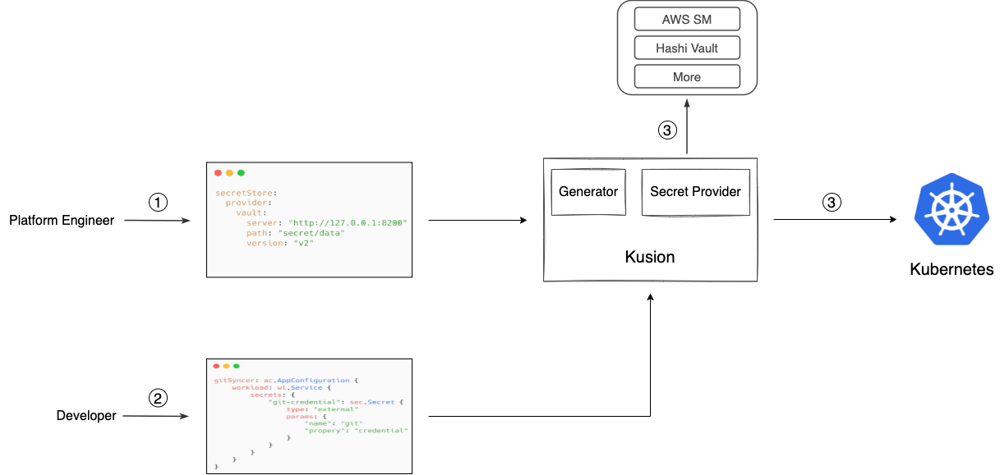

## Secret Management with Kusion

### Motivation

A secret is any piece of sensitive information that must be kept confidential and protected from unauthorized access, this includes passwords, API keys, TLS certificates, tokens, or other credentials. Secret management is a critical aspect of managing any application or infrastructure, therefore Kusion must provide out-of-the-box support. This proposal outlines the method and workflow of How Kusion implement basic secret management.

### Principle

* Perfect security is impossible, the deeper down the rabbit hole, the greater cost you have to pay, tradeoff in avilability of more complicated solutions must always be considered. For Kusion we have to make trade-offs and prioritize the most likely scenarios.
* Keeping secrets outside of Git is especially important for future-proofing, even encrypted secrets are not recommended to check into Git. Git is designed to keep a persistent history of all your code changes, so once a secret is checked into Git, removing it requires rewriting history, and that can be really hard even impossible.
* Best practices for secrets management advocate the adoption of centralized secrets management solutions, which ensure consistency and standardization across the organization. For Kusion we need to support various popular centralized secrets management solutions, e.g AWS Secrets Manager, Azure Key Vault, Hashicorp Vault, and no need to install additional operators.

### Design Details

#### Threat Model

This [blog](https://www.macchaffee.com/blog/2022/k8s-secrets/) talks about a rudimentary [Threat Model](https://en.wikipedia.org/wiki/Threat_model) for Kubernetes Secrets, which exposes an inconvenient truth that storing secrets is hard since the plaintext version has to exist somewhere (in contrast to e.g. password hashes). There are indeed complex alternative solutions to plain Kubernetes Secrets offer enough extra security, however those enough security out of the complex arragement might not be worth it. From Kusion's perspective, mitigate the overall attack surface of plain Kubernetes Secrets is extremely difficult, also out of scope, so we just assume plain Kubernetes Secrets are fine, instead we provide comprehensive integration with popular cloud secret managers. 

#### API Types

To support popular cloud secret managers, we need to have multiple secret store. We could define a simple interface along the lines of: 

```Go
// SecretStore provides the interface to interact with various cloud secret manager.
type SecretStore interface {
	// GetSecret retrieves ref secret from various cloud secret manager.
	GetSecret(ctx context.Context, ref secretsapi.ExternalSecretRef) ([]byte, error)
}
```

and different secret stores just need to implement this interface. For different secret stores, the initialization process is quite different, so we adopt the factory method pattern:

```Go
// SecretStoreFactory is a factory type for secret store.
type SecretStoreFactory interface {
	// NewSecretStore constructs a usable secret store with specific provider spec.
	NewSecretStore(spec secretsapi.SecretStoreSpec) (SecretStore, error)
}
```

Based on the specifications predefined by platform team, secret store factory constructs proper secret store instance, and the specifications as shown below: 

```Go
// SecretStoreSpec contains configuration to describe target secret store.
type SecretStoreSpec struct {
	Provider *ProviderSpec `yaml:"provider" json:"provider"`
}

// ProviderSpec contains provider-specific configuration.
type ProviderSpec struct {
	// AWS configures a store to retrieve secrets from AWS Secrets Manager.
	AWS *AWSProvider `yaml:"aws,omitempty" json:"aws,omitempty"`
}

// AWSProvider configures a store to retrieve secrets from AWS Secrets Manager.
type AWSProvider struct {
	// AWS Region to be used to interact with AWS Secrets Manager.
	// Examples are us-east-1, us-west-2, etc.
	Region string `yaml:"region" json:"region"`
}
```

#### The Workflow

Based on the [collaboration paradigm](../collaboration/collaboration_paradigm.md) defined by Kusion as 
well as the fundamental [workspace management](../workspace_management/workspace_management.md) capability, the 
overall workflow of Kusion secrets management includes following steps:

1. During the workspace initialization phase, platform team setup the target secret store, including necessary credentials info to interact with secret store.

2. The application developers specify the ref sources of sensitive information that the workload depends on, as well as how the workload consumes this sensitive information, within the configuration code.

3. Once configuration code submit, the Kusion engine fetchs secrets from target secret store and creates corresponding Kubernetes secrets. Application process consume Kubernetes secrets during runtime.

<p align="center">


### References

1. [https://developer.hashicorp.com/vault/tutorials/kubernetes/vault-secrets-operator](https://developer.hashicorp.com/vault/tutorials/kubernetes/vault-secrets-operator) -- Vault Secret Operator
2. [https://sharonsahadevan.medium.com/kubernetes-secret-management-a-comprehensive-guide-with-aws-secrets-manager-bdebbd70d7b1](https://sharonsahadevan.medium.com/kubernetes-secret-management-a-comprehensive-guide-with-aws-secrets-manager-bdebbd70d7b1) -- AWS Secret Manager
3. [https://learn.microsoft.com/en-us/azure/aks/developer-best-practices-pod-security#use-azure-key-vault-with-secrets-store-csi-driver](https://learn.microsoft.com/en-us/azure/aks/developer-best-practices-pod-security#use-azure-key-vault-with-secrets-store-csi-driver) -- AKS with Azure Key Vault
3. [https://www.macchaffee.com/blog/2022/k8s-secrets/](https://www.macchaffee.com/blog/2022/k8s-secrets/) -- Plain Kubernetes Secrets are fine