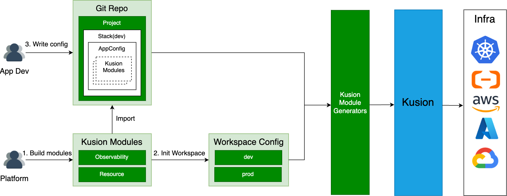

# Kusion Workspace Management Proposal

## Context

Towards the version 0.10.0, Kusion is about to make a huge upgrade: the unambiguous definition of responsibility and collaboration paradigm between platform engineers and application developers through the application delivery process. The platform engineers firstly define modules and corresponding application-oriented schemas, where the latter constitute the application schema [AppConfiguration](https://www.kusionstack.io/docs/concepts/appconfigurations), and secondly initialize workspaces and corresponding configurations. The application developers select workspace and fill in the fields of AppConfiguration. Then, executing the delivery action in a trusted workspace, e.g. a CD pipeline, to apply the application intent from both the platform engineers and application developers.

The upgrade defines the role of platform engineers and the concepts of **Module** and **workspace**. The Module is a building block enabling the building the intent of a set of resources from **Schema Configuration** and **Workspace Configuration**. While the workspace is a collection of application-independent configurations, and a workspace configuration is composed of a set of module inputs, which forms the entire module inputs combined with schema configuration.

<br />

## Goals and Non-Goals

### Goals

1. Give the definition of workspace;
2. Define the writing format of workspace configurations;
3. Provide the commands to manage workspaces;
4. Give the SDK to parse workspace config to structured data.

### Non-Goals

1. Only support local file based workspace management, the support of other storage backends is not the goal of version 0.10.0;
2. Only consider using Kusion in CLI format, the usage of service layer is not considered.

## Proposal

### Definition

Workspace is a logical concept representing a target that a stack will be deployed to, which contains a set of configurations, kubeconfig and provider authentication information that can be reused by multiple stacks. We recommend workspaces grouped by SDLC phases or cloud vendors. For example, it could be named as dev, staging, and prod or cloud vendors such as AWS, Azure, and Aliyun.

At the product level, Kusion does not support multiple clouds or multiple regions in a workspace. Although users can define an artful module which builds a schema into multiple resources in multiple clouds or regions. Kusion cannot forbid such modules, but doesn't recommend it and will not provide supportive technical means of multiple clouds or region in a workspace. If a platform team needs to manage multiple clouds or regions, just create multiple workspaces.

For clarity, the workspace data is separated into two types: configuration and secret, where the former is non-sensitive data, and the latter is sensitive data. Workspace configuration is kept by yaml file when stored locally, and includes a set of module inputs, runtime configs, and backend configs for now. Workspace secret is kept by workspace variables. For example, using AWS must set correct workspace variables of `AWS_ACCESS_KEY_ID` and `AWS_SECRET_ACCESS_KEY`.

For the set of data items that serves the same target, if one or more than one of them is sensitive data, then the whole set of data items should be kept by environment variables. Ding so is to provide a continuous, smooth experience.

According to [Building the collaboration paradigm between App Developers and Platform Developers with Kusion.md](https://www.kusionstack.io/docs/concepts/appconfigurations), *a stack must be linked with one workspace*. The stack name must be the same as the workspace name it will deploy to.

<br />

### Workspace Config File Format

The configuration of a workspace should be maintained in a single yaml file, and the writing format and an example is shown as below.

```yaml
# Module input, each with the format standard：
# # <ModuleName>:
# #   default: # default configurations, applied to all projects
# #     <ModuleInput_Field1>: <value1>
# #     <ModuleInput_Field2>: <value2>
# #     ...
# #   <patcherName>: #patcher configurations, applied to the projects assigned in projectSelector
# #     <ModuleInput_Field1>: <value1_Override>
# #     ...
# #     projectSelector:
# #     - <projectName1>
# #     ...
modules:
  database:
    default:
      provider: aws
      size: 20
      instanceClass: db.t3.micro
      securityIPs:
      - 10.0.0.0/18
    smallClass:
      size: 50
      instanceClass: db.t3.small
      projectSelector:
      - foo
      - bar
    largeClass:
      instanceClass: db.t3.large
      projectSelector:
      - baz
    
# A set of runtime configs, each with the format standard:
# # <RuntimeName>:
# #   <RuntimeConfig_Field1>: <value1>
# #   <RuntimeConfig_Field2>: <value2>
# #   ...
runtimes:
  kubernetes:
    kubeConfig: /etc/kubeconfig.yaml
  terraform:
    aws:
      version: 1.0.4
      source: hashicorp/aws
      region: us-east-1
      
# A set of backend configs, each with the following format standard:
# # <BackendName>:
# #   <BackendConfig_Field1>: <value1>
# #   <BackendConfig_Field2>: <value2>
# #   ...
backends:
  s3: 
    bucket: kusion
    region: us-east-1
```

The workspace configuration file is composed of several blocks, now includes `modules`, `runtimes` and `backends`. Each block is a yaml dictionary, whose value is a set of corresponding configs.

A module config is composed of a default configs and several patchers, where the name of patcher must not be default. For default config or a certain patcher, the structure is also a yaml dictionary, and the key must be the module input field name.

Runtime config supports `kubernetes` and `terraform` for now, where the former includes `kubeConfig`, and the latter includes the data of terraform providers, which differ from different providers. For terraform providers, there may exist sensitive data, which should be kept by environment variables.

Backend config supports `local`, `oss`, `s3`, `database` and `http` for now, which defines the backend of state, intent and other need-storage kusion data which may exist in the future. This format asks for all the kusion data shares the same backend, the more fine-grained backend config is not in the consideration of this iteration. Which is the same as the sensitive data in the runtime config, they should be kept by environment variables.

Following the writing format standard above, we can achieve:

- Clearly define the modules' inputs, runtime config and backend config in a workspace;
- Support customized module configurations for some projects;
- Use a unify function to combine schema configurations and workspace module configurations to form the entire inputs for all modules.

### Commands

Kusion provides the management of workspace by sub command `kusion workspace`, the designed command is shown as below.

#### kusion workspace create \<name> -f \<configFilePath>

Create a workspace. A new workspace configuration file named `<name>.yaml` will be created under the path `$KUSION_PATH/.workspace`, and the validation will be done before the creation.

#### kusion workspace update \<name> -f \<configFilePath>

Create a workspace configuration.

#### kusion workspace delete \<name>

Delete a workspace configuration.

#### kusion workspace list

List all the initialized workspaces.

#### kusion workspace show \<name>

Show the configurations of specified workspace.

There are the user cases:

- **Individual developer**: The user creates workspaces as needed (e.g. dev, pre and prod), and writes AppConfiguration codes in corresponding project and stacks locally. When applying a specified stack, set kubeconfig and provider authentication info, and corresponding workspace configurations are used automatically to build intent.
- **Collaboration Scenario**: An application developer gets the names of workspaces in use, then write project and stack AppConfiguration codes locally, with stack name the same as workspace name. In CI/CD pipeline, create workspaces according to the changed stacks, set kubeconfig and provider authentication info, then apply a specified stack. In this scenario, the full workspace configurations should be stored by platform team for now. After the support of centralized storage backend, the storage work of workspace configuration can be handled by Kusion.

Limited by the Kusion CLI format, in the collaboration scenario, application developers cannot list the workspaces platform teams provide, cause kusion is not a long-running service. Even though there is the support of the centralized storage, such as db, application developers cannot list workspaces through CLI either, cause the db password is kept by platform team and should not expose to an application developer. If there was service layer, we can do more things!

### SDK of Parsing workspace Configuration

There are the two primary domain models designed. The first one is `WorkspaceConfig`, which is used to keep all the configs. The second one is `WoekspaceOperator`, which performs the operation of list, get, set, etc. 

The design of workspace config is as follows.

```Go
package workspace

type Config struct {
	Modules map[string]ModuleConfigs `yaml:"modules,omitempty" json:"modules,omitempty"`
	Runtimes map[string]RuntimeConfig `yaml:"runtimes,omitempty" json:"runtimes,omitempty"`
	Backends map[string]BackendConfig `yaml:"backends,omitempty" json:"backends,omitempty"`
}

type Module interface {
	ModuleName() string
}

type ModuleConfig struct {
	Module
	ProjectSelector []string `yaml:"projectSelector,omitempty" json:"projectSelector,omitempty"`
}

type ModuleConfigs map[string]*ModuleConfig

type BackendConfig interface {
	BackendName() string
}

type RuntimeConfig interface {
	RuntimeName() string
}

// The following functions need to provide.
/* 
func ParseConfig(data []byte) (*Config, error) {}
func ParseConfigFromYamlFile(path string) (*Config, error) {}
func (c *Config) Validate() error {}
func (c *Config) GetModule(projectName, moduleName string) (Module, error) {}
func (c *Config) GetRuntimeConfig(runtimeName string) (RuntimeConfig, error) {}
func (c *Config) GetRuntimeConfigs() (map[string]RuntimeConfig, error) {}
func (c *Config) GetBackendConfig() (string, BackendConfig, error) {}
*/
```

Cause the definition of `Module`, `BackendConfig` and `RuntimeConfig` is interface, to do correct deserialization and validation, there is a registry to keep all the modules, backends and runtimes that kusion supports, and a model named `unstructuredConfig` to do deserialization job.

```GO
package workspace

type unstructuredConfig struct {
	Modules  map[string]any `yaml:"modules,omitempty" json:"modules,omitempty"`
	Runtimes map[string]any `yaml:"runtimes,omitempty" json:"runtimes,omitempty"`
	Backends map[string]any `yaml:"backends,omitempty" json:"backends,omitempty"`
}
```

The design of workspace operator is as follows, `storagePath` is the place to store the workspace config locally.

```GO
package workspace

type Operator struct {
	storagePath string
}

// The following functions need to provide.
/*
func (o *Operator) GetWorkspaces() ([]string, error) {}
func (o *Operator) GetWorkspaceConfig(name string) (*Config, error) {}
func (o *Operator) GetUnstructuredWorkspaceConfig(name string) (*unstructuredConfig, error) {}
func (o *Operator) SetWorkspaceConfig(name string, config *Config) error {}
*/
```